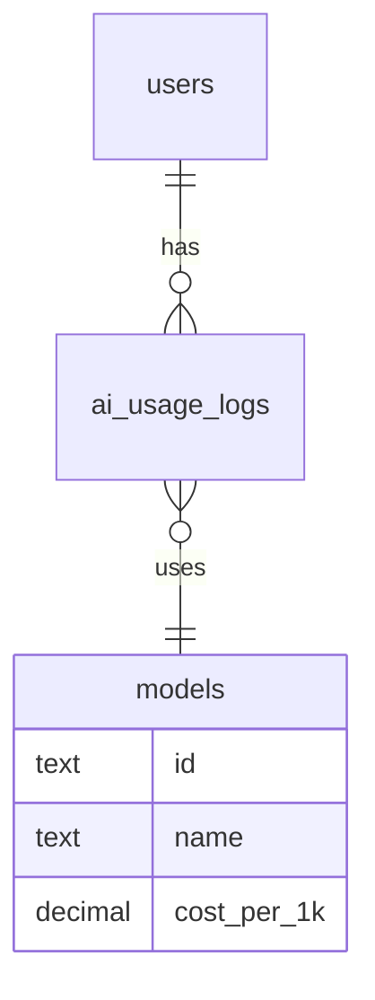

# 🤖 AI Usage System — Концепция, Архитектура и Логика

**Проект:** UNITY-v2
**Версия:** 2.0
**Дата обновления:** 2025-01-18
**Автор:** Команда UNITY
**Статус:** Синхронизирован с мастер-планом

> **Важно**: Этот документ детализирует AI-систему из [UNITY_MASTER_PLAN_2025.md](./UNITY_MASTER_PLAN_2025.md)

---

## 🎯 Цель

Создать прозрачную, масштабируемую и экономичную систему отслеживания, анализа и управления AI-запросами, используемыми платформой UNITY.  
Система должна:
- снижать издержки на использование OpenAI API;
- предоставлять SuperAdmin полную аналитику расходов;
- позволять гибко настраивать модели и лимиты;
- формировать базу для тарифной монетизации AI.

---

## 🧩 1. Концепция

AI — центральный элемент экосистемы UNITY. Он помогает пользователю осознанно фиксировать, анализировать и проживать свои достижения.  
Каждое взаимодействие с AI создаёт **ценность** для пользователя и **стоимость** для платформы.

Для устойчивой экономики проекта требуется:
1. Гибкое управление моделями (экономия токенов);
2. Сбор аналитики по пользователям и операциям;
3. Автоматический учёт расходов;
4. Возможность прогнозирования себестоимости и формирования тарифов.

---

## ⚙️ 2. Типы AI-операций

| Тип операции | Назначение | Пример задачи | Рекомендуемая модель |
|---------------|------------|----------------|----------------------|
| `ai_card` | Генерация мотивационных карточек | “Что я сделал сегодня?” | `gpt-4o-mini` |
| `ai_summary` | Генерация недельных/месячных отчётов | “Создать PDF книгу достижений” | `gpt-4o` |
| `emotion_analysis` | Анализ эмоций в заметках | “Какое настроение в моих записях?” | `gpt-4o-mini` |
| `voice_to_text` | Распознавание речи | “Преобразовать голосовую заметку” | `whisper-1` |
| `ai_coach` | Диалоговый ассистент UNITY Coach | “Как мне поддержать мотивацию?” | `gpt-4o` |

---

## 💰 3. Модель ценообразования и экономии

### 💡 Принципы
1. Каждая операция использует оптимальную модель под задачу.
2. Для массовых функций (карточки, эмоции) используется `gpt-4o-mini`.
3. Для глубоких инсайтов — `gpt-4o`.
4. Все вызовы логируются и агрегируются в Supabase.

### 💵 Средняя стоимость 1K токенов:
| Модель | Стоимость | Использование |
|--------|------------|---------------|
| GPT-4 | $0.03 | Не используется для массовых операций |
| GPT-4o | $0.005 | Основной аналитический слой |
| GPT-4o-mini | $0.0006 | Массовые операции |
| Whisper-1 | $0.006 / минута | Распознавание речи |

---

## 🧱 4. Архитектура системы логирования

### 📄 Таблица `ai_usage_logs`

| Поле | Тип | Описание |
|------|-----|-----------|
| id | uuid | Уникальный идентификатор |
| user_id | uuid | Пользователь, вызвавший операцию |
| model | text | Модель OpenAI |
| operation_type | text | Тип операции |
| tokens_input | int | Входные токены |
| tokens_output | int | Выходные токены |
| cost_usd | decimal | Стоимость операции |
| created_at | timestamp | Дата вызова |
| metadata | jsonb | Контекст (язык, длина текста, эмоции и т.п.) |

---

## 🧠 5. Middleware “AI Service Wrapper”

```ts
// aiService.ts
async function runAI({ userId, operationType, content }) {
  const model = await getModelByOperation(operationType);
  const completion = await openai.chat.completions.create({
    model,
    messages: [{ role: "user", content }],
  });

  const usage = completion.usage;
  const cost = calculateCost(model, usage.total_tokens);

  await db.ai_usage_logs.insert({
    user_id: userId,
    model,
    operation_type: operationType,
    tokens_input: usage.prompt_tokens,
    tokens_output: usage.completion_tokens,
    cost_usd: cost,
    created_at: new Date(),
  });

  return completion.choices[0].message.content;
}
```

---

## 🧮 6. Раздел “Аналитика → AI” (SuperAdmin Dashboard)

### 📊 Главный экран
- **График расходов** за день/неделю/месяц  
- **Общая стоимость AI за период**  
- **Топ-5 пользователей** по расходам  
- **Популярные типы операций**  
- **Доля использования моделей (Pie chart)**

### 👤 Вкладка “Пользователи”
| Пользователь | Кол-во запросов | Токены | Стоимость | Модель | Последний вызов |
|---------------|----------------|---------|------------|---------|------------------|
| @karina | 185 | 45,000 | $1.82 | gpt-4o-mini | 18.10.2025 |

> Возможность фильтрации по периоду и экспорта в CSV.

### 🧩 Вкладка “Типы операций”
| Тип | Модель | Запросов | Средняя стоимость | Общая стоимость |
|------|---------|-----------|------------------|----------------|
| ai_card | gpt-4o-mini | 5,000 | $0.00018 | $0.90 |
| ai_summary | gpt-4o | 210 | $0.06 | $12.60 |

### ⚙️ Вкладка “Модели”
- Диаграмма эффективности по цене/токенам  
- Автоматические рекомендации по оптимизации (“заменить часть ai_card на gpt-4o-mini”)

---

## ⚙️ 7. Раздел “Настройки → AI”

| Настройка | Описание |
|------------|-----------|
| **API Key** | Ввод и проверка ключа OpenAI |
| **Назначение моделей по операциям** | Таблица выбора модели для каждой функции |
| **Лимиты токенов** | Глобальные или пользовательские лимиты |
| **Бюджет AI (в месяц)** | Предупреждение при достижении лимита |
| **Тестовый режим** | Использование sandbox-ключа без реальных затрат |

---

## 📊 8. Экономическая аналитика и тарифы

### Формулы
```
AI_Cost_User = SUM(cost_usd) / активные дни
AI_Cost_Operation = SUM(cost_usd) / количество запросов
```

### Пример анализа:
| Пользователь | Запросов | Стоимость | Себестоимость (1 запись) | Рекоменд. тариф |
|---------------|-----------|------------|---------------------------|----------------|
| Анна | 120 | $0.62 | $0.005 | Free |
| Карина | 480 | $3.20 | $0.006 | Premium |
| Алексей | 50 | $0.21 | $0.004 | Free |

---

## 🚨 9. Мониторинг и уведомления

- Уведомление при превышении дневного бюджета.
- Автоматический отчёт на email SuperAdmin каждые 24 часа.
- Возможность интеграции с Telegram-ботом для мгновенных алертов.

---

## 💾 10. Интеграция с аналитикой UNITY

AI Usage System синхронизируется с другими модулями:
- **PDF-книга** — генерируется на основе логов за месяц;
- **AI-инсайты** — формируются на основании накопленных паттернов;
- **Поведенческая аналитика** — прогнозирует активность и спады.

---

## 🧩 11. Архитектура базы данных (связи)



---

## 🚀 12. Технический стек

| Компонент | Технология |
|------------|-------------|
| Backend | Supabase Edge Functions |
| Frontend | React + Shadcn/UI |
| Charts | Recharts |
| Storage | Supabase + PostgreSQL |
| Deployment | Vercel |
| Integration | OpenAI SDK v4 |

---

## 🔒 13. Безопасность и контроль

- Хранение ключа в Supabase Secrets.  
- Все вызовы проходят через авторизованные Edge Functions.  
- Ограничение ролей:  
  - `super_admin` — управление настройками, просмотр логов.  
  - `user` — только собственные операции.

---

## 🧭 14. Будущее развитие

| Версия | Нововведение | Цель |
|---------|---------------|------|
| v1.1 | Автооптимизация моделей | Снижение расходов |
| v1.2 | Прогноз затрат на основе активности | Планирование бюджета |
| v1.3 | Тарифная интеграция (Free / Premium / Pro) | Монетизация AI |
| v1.4 | AI-советник для SuperAdmin | Рекомендации по управлению затратами |

---

## 📘 Итог

AI Usage System — это фундамент аналитической и экономической архитектуры UNITY.  
Она позволяет:
- видеть реальную себестоимость AI,
- регулировать модели и бюджеты,
- строить устойчивую монетизацию.

UNITY не просто использует AI — он осознанно управляет им.  
Это шаг к зрелой экосистеме, где интеллект служит человеку, а не наоборот.

---

**Документ создан:** 2025-10-18  
**Ответственный:** Product Team UNITY  
**Формат:** PRD + Technical Specification
