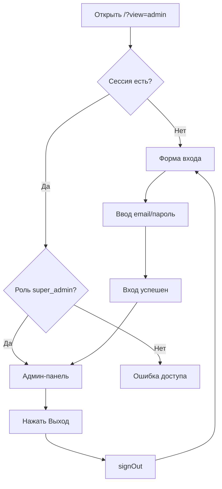
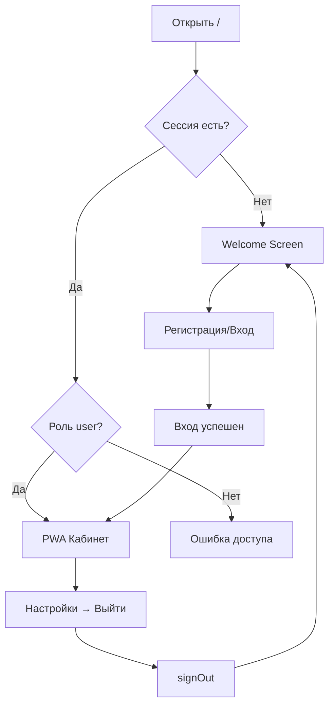

# Управление сессиями в UNITY-v2

**Дата создания:** 2025-10-21  
**Статус:** ✅ Реализовано  
**Версия:** 1.0

---

## 📋 Обзор

Система управления сессиями в UNITY-v2 реализует **разделение политик безопасности** для двух типов пользователей:

1. **Супер-админ** - полный сброс сессии при выходе для максимальной безопасности
2. **PWA пользователь** - полный сброс сессии только при явном выходе через настройки

---

## 🎯 Цели

### Безопасность
- ✅ Супер-админ не может случайно оставить активную сессию
- ✅ Защита от несанкционированного доступа к админ-панели
- ✅ Соответствие best practices для административных панелей

### UX (User Experience)
- ✅ PWA пользователь не видит welcome screen каждый раз
- ✅ Быстрый доступ к дневнику для PWA пользователей
- ✅ Пользователь сам контролирует когда выйти

---

## 🔒 Политики безопасности

| Аспект | Супер-админ | PWA Пользователь |
|--------|-------------|------------------|
| **Риск** | Высокий (доступ ко всей системе) | Низкий (только свои данные) |
| **Сессия при выходе** | Полный сброс (`signOut()`) | Полный сброс (`signOut()`) |
| **Welcome Screen** | Всегда форма входа админа | Показывается после выхода |
| **Автоматический вход** | ❌ Нет | ✅ Да (если не вышел) |

---

## 💻 Техническая реализация

### 1. Супер-админ

**Файл:** `src/App.tsx`

**Метод:** `handleAdminLogout()`

```typescript
const handleAdminLogout = async () => {
  console.log("🔐 [App.tsx] Admin logout - clearing session for security");
  await signOut(); // Полная очистка сессии для безопасности
  setUserData(null);
  setOnboardingComplete(false);
  setCurrentStep(1);
  setShowAdminAuth(true); // Показываем форму входа админа
};
```

**Использование:**
```typescript
<AdminApp
  userData={userData}
  showAdminAuth={showAdminAuth}
  onAuthComplete={handleAdminAuthComplete}
  onLogout={handleAdminLogout} // ← Используется для супер-админа
  onBack={() => { window.location.href = '/'; }}
/>
```

**Поведение:**
1. Пользователь нажимает "Выход" в админ-панели
2. Вызывается `handleAdminLogout()`
3. Сессия Supabase полностью сбрасывается
4. Показывается форма входа админа (`/?view=admin`)
5. При следующем посещении `/?view=admin` - всегда форма входа

---

### 2. PWA Пользователь

**Файл:** `src/App.tsx`

**Метод:** `handleLogout()`

```typescript
const handleLogout = async () => {
  console.log("🚪 [App.tsx] PWA user full logout - clearing session for welcome screen");
  await signOut(); // Полная очистка сессии чтобы показать welcome screen
  setUserData(null);
  setOnboardingComplete(false);
  setCurrentStep(1); // Возврат к welcome screen
  setShowAdminAuth(false);
};
```

**Использование:**
```typescript
<MobileApp
  currentStep={currentStep}
  userData={userData}
  onWelcomeSkip={handleWelcomeSkip}
  onOnboarding2Complete={handleOnboarding2Complete}
  onOnboarding3Complete={handleOnboarding3Complete}
  onOnboarding4Complete={handleOnboarding4Complete}
  onAuthComplete={handleAuthComplete}
  onLogout={handleLogout} // ← Используется для PWA пользователя
  onProfileUpdate={handleProfileUpdate}
/>
```

**Поведение:**
1. Пользователь открывает настройки
2. Нажимает кнопку "Выйти"
3. Вызывается `handleLogout()`
4. Сессия Supabase полностью сбрасывается
5. Показывается welcome screen (шаг 1)
6. При следующем посещении `/` - welcome screen

---

## 🔄 Жизненный цикл сессии

### Супер-админ



### PWA Пользователь



---

## 🧪 Тестирование

### ТЕСТ 1: Супер-админ выходит

**Шаги:**
1. Открыть `http://localhost:3000/?view=admin`
2. Войти как `diary@leadshunter.biz` / `admin123`
3. Нажать кнопку "Выход"

**Ожидаемый результат:**
- ✅ Лог: `🔐 [App.tsx] Admin logout - clearing session for security`
- ✅ Показывается форма входа админа
- ✅ Сессия Supabase сброшена

**Статус:** ✅ ПРОЙДЕН

---

### ТЕСТ 2: PWA пользователь выходит

**Шаги:**
1. Открыть `http://localhost:3000/`
2. Войти как обычный пользователь
3. Открыть настройки
4. Нажать кнопку "Выйти"

**Ожидаемый результат:**
- ✅ Лог: `🚪 [App.tsx] PWA user full logout - clearing session for welcome screen`
- ✅ Показывается welcome screen
- ✅ Сессия Supabase сброшена

**Статус:** ⏳ НЕ ПРОТЕСТИРОВАН (требует входа как PWA пользователь)

---

### ТЕСТ 3: Автоматический вход PWA пользователя

**Шаги:**
1. Войти как PWA пользователь
2. Закрыть браузер
3. Открыть `http://localhost:3000/` снова

**Ожидаемый результат:**
- ✅ Автоматический вход в PWA кабинет
- ✅ НЕ показывается welcome screen

**Статус:** ⏳ НЕ ПРОТЕСТИРОВАН

---

## 📝 Логи

### Супер-админ

**При выходе:**
```
🔐 [App.tsx] Admin logout - clearing session for security
```

**При входе:**
```
🔐 [AdminLoginScreen] handleLogin called
🔐 [AdminLoginScreen] Starting login process...
🔐 [AdminLoginScreen] Supabase client created
Admin login successful: diary@leadshunter.biz role: super_admin
🔐 [AdminLoginScreen] Calling onComplete...
🔐 [App.tsx] Admin auth complete: diary@leadshunter.biz role: super_admin
🔐 [AdminLoginScreen] onComplete called
```

### PWA Пользователь

**При выходе:**
```
🚪 [App.tsx] PWA user full logout - clearing session for welcome screen
```

---

## 🔧 Конфигурация

### Supabase Auth

**Файл:** `src/utils/supabase/client.ts`

```typescript
export const signOut = async () => {
  const supabase = createClient();
  const { error } = await supabase.auth.signOut();
  if (error) {
    console.error('Sign out error:', error);
  }
};
```

**Настройки:**
- **Session persistence:** `localStorage` (по умолчанию)
- **Auto refresh:** Включено
- **Session timeout:** 1 час (Supabase default)

---

## ✅ Решенные проблемы

### ~~Проблема 1: Бесконечная загрузка при входе админа~~ (РЕШЕНО)

**Симптомы (до исправления):**
- После нажатия "Войти" кнопка показывала "Вход..." и зависала
- Страница оставалась на форме входа
- Только после обновления страницы админ-панель загружалась

**Причина:**
- Fetch к Edge Function `profiles` зависал
- PWA пользователи использовали прямой запрос к БД через Supabase client
- Супер-админ использовал fetch к Edge Function

**Решение (2025-10-21):**
- ✅ Изменен `AdminLoginScreen.tsx` для использования прямого запроса к БД
- ✅ Убран fetch к Edge Function `profiles`
- ✅ Используется тот же подход что и для PWA пользователей: `supabase.from('profiles').select('*')`
- ✅ Убран `setTimeout` так как проблема была не в размонтировании компонента

**Результат:**
- ✅ Вход админа работает мгновенно
- ✅ Нет бесконечной загрузки
- ✅ PWA пользователи не сломались
- ✅ Код стал проще и надежнее

**Статус:** ✅ РЕШЕНО
**Дата:** 2025-10-21

---

## 📚 Связанные документы

- [ROLE_BASED_ACCESS_CONTROL.md](./ROLE_BASED_ACCESS_CONTROL.md) - Разделение доступа по ролям
- [TEST_ACCOUNTS.md](../testing/TEST_ACCOUNTS.md) - Тестовые аккаунты
- [AUTHENTICATION.md](./AUTHENTICATION.md) - Общая документация по аутентификации

---

## 🔄 История изменений

| Дата | Версия | Изменения |
|------|--------|-----------|
| 2025-10-21 | 1.0 | Первая версия документации |

---

**Автор:** AI Assistant  
**Последнее обновление:** 2025-10-21

