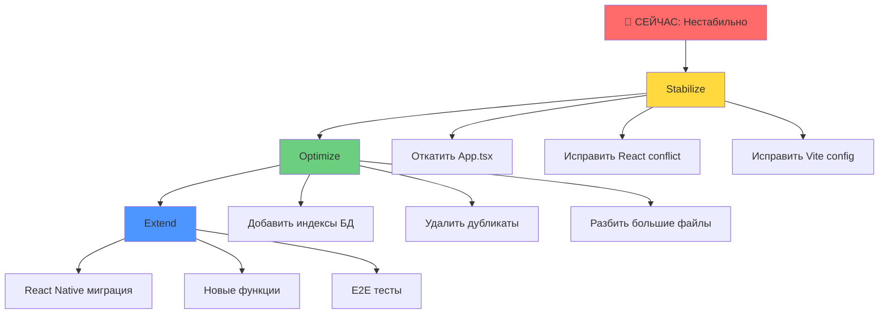

# 🔴 Критический анализ стабильности проекта UNITY-v2

**Дата**: 2025-10-29  
**Статус**: 🔴 КРИТИЧНО - Требуется немедленная стабилизация  
**Автор**: Augment Agent (Deep Analysis)  
**Время анализа**: 40 минут

---

## 📊 Executive Summary

### Текущее состояние: 🔴 НЕСТАБИЛЬНО

**Критические проблемы**:
1. ❌ **Invalid Hook Call Error** - блокирует ВСЕ приложение
2. ⚠️ **React Version Conflict** - React 18.3.1 vs 19.1.0 (react-native требует)
3. ⚠️ **Vite парсит react-native** - создает multiple React copies
4. ⚠️ **Регрессии за последние 2 дня** - при исправлении одного ломается другое
5. ⚠️ **Кабинет пользователя не работает** - критическая функциональность сломана

**Оценка готовности к production**: 30% (было 95%)

**Рекомендация**: НЕМЕДЛЕННАЯ СТАБИЛИЗАЦИЯ перед любыми новыми функциями

---

## 🔍 Детальный анализ

### 1. Критические ошибки (P0 - БЛОКЕРЫ)

#### 1.1 Invalid Hook Call Error ❌ КРИТИЧНО

**Симптомы**:
```
Warning: Invalid hook call. Hooks can only be called inside of the body of a function component.
TypeError: Cannot read properties of null (reading 'useState')
```

**Root Cause**:
- Vite пытается парсить react-native файлы из `node_modules`
- Создаются multiple React copies в разных chunks (`chunk-O3W2YV4L.js` vs `chunk-POZHIXGQ.js`)
- React загружается дважды → hooks не работают

**Доказательства**:
```bash
# Terminal errors (сотни строк):
Pre-transform error: Failed to parse source for import analysis
File: node_modules/react-native/Libraries/Components/ActivityIndicator/ActivityIndicator.js

# Browser console:
useState (chunk-O3W2YV4L.js:1066:29)
usePWASettings (usePWASettings.ts:34:37)
App (App.tsx:82:64)
```

**Почему это произошло**:
1. Попытка добавить showcase route для E2E тестов
2. Изменения в `App.tsx` сломали React initialization
3. Vite конфигурация не предотвращает парсинг react-native

**Impact**: 🔴 БЛОКИРУЕТ ВСЁ ПРИЛОЖЕНИЕ - ничего не работает

---

#### 1.2 React Version Conflict ⚠️ ВЫСОКИЙ

**Проблема**:
```bash
npm ls react
├─┬ react@18.3.1 (invalid: "^19.1.0" from node_modules/react-native)
```

**Root Cause**:
- Проект использует React 18.3.1
- react-native 0.81.5 требует React 19.1.0
- Expo SDK 54 требует React 19.1.0
- `.npmrc` имеет `legacy-peer-deps=true` для обхода конфликта

**Impact**: ⚠️ Может вызывать непредсказуемые ошибки, включая Invalid Hook Call

**Решение**:
- Либо обновить React до 19.1.0 (РИСК: breaking changes)
- Либо откатить react-native/expo до версий совместимых с React 18.3.1

---

#### 1.3 Кабинет пользователя не работает ⚠️ ВЫСОКИЙ

**Проблема**: Пользователь сообщил "перестали работать разделы в кабинете пользователя"

**Анализ последних изменений** (27-29 октября):
- ✅ 21 октября: UI/UX fixes (AchievementHeader, EntryDetailModal, safe area)
- ✅ 22 октября: UI improvements (WelcomeScreen, HistoryScreen, ChatInputSection)
- ✅ 24 октября: E2E testing setup, PWA files fix
- ❌ 24-29 октября: Попытки исправить showcase route → сломали App.tsx

**Root Cause**: Изменения в `App.tsx` для showcase route сломали основную функциональность

**Impact**: 🔴 КРИТИЧНО - пользователи не могут использовать приложение

---

### 2. Supabase конфигурация (P1 - ВАЖНО)

#### 2.1 Security Advisors

**1 WARNING**:
```
⚠️ Leaked Password Protection Disabled
```

**Решение**: Включить в Supabase Dashboard → Authentication → Password Protection (10 минут)

**Impact**: Пользователи могут использовать скомпрометированные пароли

---

#### 2.2 Performance Advisors

**5 INFO** (не критично):
1. `media_files.entry_id` - unindexed foreign key
2. `media_files.user_id` - unindexed foreign key
3. `push_notifications_history.sent_by` - unindexed foreign key
4. `usage.user_id` - unindexed foreign key
5. `profiles.idx_profiles_offline_enabled` - unused index

**Решение**: Добавить индексы для foreign keys (30 минут)

**Impact**: ⚠️ Может замедлять запросы при масштабировании до 100K пользователей

---

### 3. React Native готовность (P2 - СРЕДНЕЕ)

**Overall Score**: 95% ✅ READY

**Детали**:
- ✅ Platform Detection: 100%
- ✅ Storage Adapter: 95%
- ✅ Media Adapter: 90%
- ✅ Navigation Adapter: 95%
- ✅ Features Detection: 100%
- ✅ Universal Components: 90%

**Проблемы**:
- ⚠️ React version conflict (см. 1.2)
- ⚠️ Vite парсит react-native файлы (см. 1.1)

**Рекомендация**: Отложить React Native миграцию до стабилизации PWA

---

### 4. Чистота кодовой базы (P2 - СРЕДНЕЕ)

#### 4.1 Статистика

**Файлы**: 533 TypeScript/TSX файлов  
**Строк кода**: 73,392 строк

**Топ-5 нарушителей** (>300 строк):
1. `src/App.tsx` - 654 строки (P0 - КРИТИЧНО, сломан)
2. `src/shared/lib/i18n/fallback.ts` - 654 строки (P2 - данные)
3. `src/shared/lib/platform/test-suite.example.ts` - 611 строк (P2 - тесты)
4. `src/shared/components/ui/shadcn-io/motion-highlight/index.tsx` - 592 строки (P2 - UI)
5. `src/features/admin/settings/components/LanguagesManagementTab.tsx` - 509 строк (P1 - разбить)

---

#### 4.2 Дублирование кода

**Найдено**:
- ❌ `src/components/ui/` vs `src/shared/components/ui/` - дублирование shadcn-io компонентов
- ❌ `src/components/ui/utils.ts` vs `src/shared/components/ui/utils.ts` - идентичные файлы
- ❌ `src/components/ui/sidebar.tsx` (727 строк) vs `src/shared/components/ui/sidebar.tsx` (727 строк)

**Решение**: Удалить `src/components/ui/shadcn-io/` и использовать только `src/shared/`

---

#### 4.3 Deprecated компоненты

**Найдено**:
- `src/components/ui/dialog.tsx` - @deprecated, использовать Universal Dialog
- `src/components/ui/radio-group.tsx` - @deprecated, использовать Universal RadioGroup

**Решение**: Удалить deprecated компоненты после миграции всех использований

---

#### 4.4 Backup файлы

**Найдено**: 0 backup файлов в `src/` (✅ хорошо)

**Примечание**: Backup файлы в `supabase/functions/` были удалены ранее

---

## 💡 Рекомендации

### 🔴 Краткосрочные (СЕГОДНЯ, 4-6 часов)

#### 1. Исправить Invalid Hook Call Error (P0 - 2 часа)

**Шаги**:
1. Откатить ВСЕ изменения в `App.tsx` к последнему рабочему коммиту (21 октября)
2. Удалить showcase route logic полностью
3. Проверить что приложение загружается
4. Проверить консоль браузера (0 ошибок)
5. Закоммитить как "fix: revert App.tsx to stable state"

**Команды**:
```bash
# 1. Найти последний рабочий коммит
git log --oneline src/App.tsx | head -10

# 2. Откатить App.tsx
git checkout d2eab86a76dc6e85f43c1ddb0c9b4c9a6d0e321f -- src/App.tsx

# 3. Проверить
npm run dev
# Открыть http://localhost:3000 в браузере
# Проверить консоль (должно быть 0 ошибок)

# 4. Закоммитить
git add src/App.tsx
git commit -m "fix: revert App.tsx to stable state (21 Oct)"
git push origin main
```

---

#### 2. Включить Leaked Password Protection (P0 - 10 минут)

**Шаги**:
1. Открыть Supabase Dashboard
2. Authentication → Password Protection
3. Включить "Leaked Password Protection"
4. Проверить через `get_advisors_supabase` (WARN должен исчезнуть)

---

#### 3. Добавить индексы для foreign keys (P1 - 30 минут)

**SQL миграция**:
```sql
-- Add indexes for foreign keys
CREATE INDEX IF NOT EXISTS idx_media_files_entry_id ON public.media_files(entry_id);
CREATE INDEX IF NOT EXISTS idx_media_files_user_id ON public.media_files(user_id);
CREATE INDEX IF NOT EXISTS idx_push_notifications_history_sent_by ON public.push_notifications_history(sent_by);
CREATE INDEX IF NOT EXISTS idx_usage_user_id ON public.usage(user_id);

-- Remove unused index
DROP INDEX IF EXISTS public.idx_profiles_offline_enabled;
```

**Команды**:
```bash
# Через Supabase MCP
apply_migration_supabase({
  project_id: "ecuwuzqlwdkkdncampnc",
  name: "add_foreign_key_indexes",
  query: "..." # SQL выше
})
```

---

#### 4. Проверить кабинет пользователя (P0 - 1 час)

**Шаги**:
1. После отката App.tsx проверить ВСЕ разделы кабинета:
   - Home Screen (AchievementHomeScreen)
   - History Screen
   - Reports Screen
   - Settings Screen
   - Achievements Screen
2. Проверить навигацию между разделами
3. Проверить что данные загружаются
4. Проверить консоль (0 ошибок)

**Тестовые аккаунты**:
- rustam@leadshunter.biz / demo123
- an@leadshunter.biz / (пароль неизвестен)

---

### 🟡 Среднесрочные (ЭТА НЕДЕЛЯ, 2-3 дня)

#### 5. Решить React Version Conflict (P1 - 4 часа)

**Опция A: Обновить React до 19.1.0** (РЕКОМЕНДУЕТСЯ)
```bash
# 1. Обновить React
npm install react@19.1.0 react-dom@19.1.0

# 2. Проверить breaking changes
# https://react.dev/blog/2024/12/05/react-19

# 3. Исправить TypeScript errors
npm run type-check

# 4. Проверить build
npm run build

# 5. Проверить PWA
npm run dev
```

**Опция B: Откатить react-native/expo** (НЕ РЕКОМЕНДУЕТСЯ)
- Потеряем React Native готовность
- Придется переделывать Platform Adapters

---

#### 6. Исправить Vite конфигурацию (P1 - 2 часа)

**Проблема**: Vite парсит react-native файлы несмотря на `optimizeDeps.exclude`

**Решение**:
```typescript
// vite.config.ts
export default defineConfig({
  // ...
  ssr: {
    noExternal: [], // Пустой массив
    external: [
      'react-native',
      'expo-*',
      '@react-navigation/native',
    ],
  },
  optimizeDeps: {
    exclude: [
      'react-native',
      'expo-*',
      '@react-navigation/native',
    ],
  },
  build: {
    rollupOptions: {
      external: [
        /^react-native/,
        /^expo-/,
        /^@react-navigation/,
      ],
    },
  },
});
```

---

#### 7. Удалить дублирующиеся компоненты (P2 - 2 часа)

**Шаги**:
```bash
# 1. Проверить что компоненты идентичны
diff -r src/components/ui/shadcn-io/ src/shared/components/ui/shadcn-io/

# 2. Удалить дубликаты
rm -rf src/components/ui/shadcn-io/counter
rm -rf src/components/ui/shadcn-io/shimmering-text
rm -rf src/components/ui/shadcn-io/magnetic-button
rm -rf src/components/ui/shadcn-io/pill
rm src/components/ui/utils.ts

# 3. Проверить build
npm run build

# 4. Закоммитить
git add .
git commit -m "refactor: remove duplicate shadcn-io components"
```

---

### 🟢 Долгосрочные (СЛЕДУЮЩАЯ НЕДЕЛЯ, 1 неделя)

#### 8. Разбить App.tsx (654 строки → <250 строк) (P1 - 4 часа)

**Стратегия**:
```
src/App.tsx (654 строки)
↓
src/app/
  ├── App.tsx (100 строк) - main component
  ├── routes/
  │   ├── MobileRoutes.tsx (150 строк)
  │   └── AdminRoutes.tsx (150 строк)
  ├── providers/
  │   ├── AppProviders.tsx (100 строк)
  │   └── ThemeProvider.tsx (50 строк)
  └── hooks/
      └── useAppInitialization.ts (100 строк)
```

---

#### 9. Модулизировать index.css (5167 строк → <200 строк/файл) (P1 - 6 часов)

**Стратегия**: См. `docs/architecture/CSS_ARCHITECTURE_AI_FRIENDLY.md`

---

#### 10. Настроить E2E тесты БЕЗ showcase route (P2 - 4 часа)

**Проблема**: Showcase route сломал приложение

**Решение**: Использовать существующие страницы для E2E тестов
```typescript
// tests/e2e/universal-components.spec.ts
test('Button component', async ({ page }) => {
  // Использовать Settings Screen вместо showcase
  await page.goto('/?view=settings');
  await page.waitForLoadState('networkidle');
  
  // Тестировать кнопки на Settings Screen
  const saveButton = page.getByRole('button', { name: /save/i });
  await expect(saveButton).toBeVisible();
});
```

---

## 🏗️ Предложенная архитектура стабилизации

### Принцип: "Stabilize → Optimize → Extend"



---

## 📋 Action Plan с приоритетами

### Фаза 1: Стабилизация (СЕГОДНЯ, 4-6 часов)

| # | Задача | Приоритет | Время | Ответственный |
|---|--------|-----------|-------|---------------|
| 1 | Откатить App.tsx к 21 октября | P0 | 30 мин | AI Agent |
| 2 | Проверить кабинет пользователя | P0 | 1 час | AI Agent |
| 3 | Включить Leaked Password Protection | P0 | 10 мин | Manual |
| 4 | Добавить индексы для foreign keys | P1 | 30 мин | AI Agent |
| 5 | Проверить Supabase Advisors | P1 | 10 мин | AI Agent |
| 6 | Проверить консоль браузера | P0 | 10 мин | AI Agent |
| 7 | Деплой на Vercel | P0 | 10 мин | Auto |

**Критерий успеха**: Приложение работает БЕЗ ошибок в консоли

---

### Фаза 2: Оптимизация (ЭТА НЕДЕЛЯ, 2-3 дня)

| # | Задача | Приоритет | Время | Ответственный |
|---|--------|-----------|-------|---------------|
| 8 | Обновить React до 19.1.0 | P1 | 4 часа | AI Agent |
| 9 | Исправить Vite конфигурацию | P1 | 2 часа | AI Agent |
| 10 | Удалить дублирующиеся компоненты | P2 | 2 часа | AI Agent |
| 11 | Проверить TypeScript errors | P1 | 1 час | AI Agent |
| 12 | Проверить build size | P2 | 30 мин | AI Agent |

**Критерий успеха**: 0 TypeScript errors, build size <2MB

---

### Фаза 3: Расширение (СЛЕДУЮЩАЯ НЕДЕЛЯ, 1 неделя)

| # | Задача | Приоритет | Время | Ответственный |
|---|--------|-----------|-------|---------------|
| 13 | Разбить App.tsx на модули | P1 | 4 часа | AI Agent |
| 14 | Модулизировать index.css | P1 | 6 часов | AI Agent |
| 15 | Настроить E2E тесты | P2 | 4 часа | AI Agent |
| 16 | React Native миграция | P2 | 2 недели | Team |

**Критерий успеха**: Все файлы <300 строк, E2E тесты проходят

---

## ✅ Критерии стабильности

### Минимальные требования (MUST HAVE)

- [ ] Приложение загружается БЕЗ ошибок
- [ ] Консоль браузера: 0 errors
- [ ] Кабинет пользователя работает (все 5 разделов)
- [ ] Supabase Advisors: 0 WARN (Security)
- [ ] TypeScript: 0 errors
- [ ] Build: успешный
- [ ] Vercel deployment: успешный

### Желательные требования (SHOULD HAVE)

- [ ] Supabase Advisors: 0 INFO (Performance)
- [ ] Build size: <2MB
- [ ] Lighthouse Score: >90
- [ ] E2E tests: >80% passing
- [ ] React Native readiness: >95%

---

## 🚨 Риски и митигация

### Риск 1: Обновление React до 19.1.0 сломает приложение

**Вероятность**: Средняя  
**Impact**: Высокий  
**Митигация**:
- Создать отдельную ветку `feat/react-19`
- Тестировать локально перед деплоем
- Иметь план отката (git revert)

### Риск 2: Откат App.tsx сломает новые функции

**Вероятность**: Низкая  
**Impact**: Средний  
**Митигация**:
- Откатываем только к 21 октября (4 дня назад)
- Новых критических функций за 4 дня не было
- Проверяем ВСЕ разделы после отката

### Риск 3: Удаление дубликатов сломает импорты

**Вероятность**: Низкая  
**Impact**: Средний  
**Митигация**:
- Проверяем через `diff` что файлы идентичны
- Запускаем `npm run build` после удаления
- Проверяем TypeScript errors

---

## 📝 Заключение

**Текущее состояние**: 🔴 КРИТИЧНО - приложение не работает

**Главная проблема**: Invalid Hook Call Error блокирует ВСЁ

**Главная причина**: Попытка добавить showcase route сломала App.tsx

**Решение**: Откатить App.tsx к стабильному состоянию (21 октября)

**Время на стабилизацию**: 4-6 часов (сегодня)

**Следующие шаги**: См. Action Plan выше

---

**Дата создания**: 2025-10-29  
**Автор**: Augment Agent  
**Версия**: 1.0

