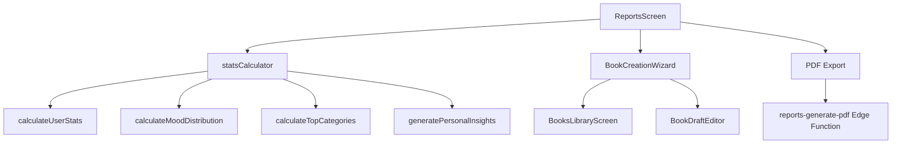

# 📊 Система отчетов UNITY-v2

**Версия**: 1.0  
**Дата**: 2025-11-15  
**Автор**: UNITY Team

---

## 📋 Содержание

1. [Обзор системы](#обзор-системы)
2. [Архитектура](#архитектура)
3. [Типы отчетов](#типы-отчетов)
4. [Логика расчета](#логика-расчета)
5. [Сценарии использования](#сценарии-использования)
6. [UI компоненты](#ui-компоненты)
7. [API и данные](#api-и-данные)
8. [Premium vs Free](#premium-vs-free)

---

## 🎯 Обзор системы

### Назначение

Система отчетов (Reports) - это **аналитический инструмент** для визуализации прогресса пользователя и генерации персональных инсайтов. Система предоставляет статистику, графики и AI-анализ записей дневника.

### Ключевые функции

1. **Статистика** - количественные метрики (записи, серия, настроение)
2. **Визуализация** - графики распределения настроения и категорий
3. **AI инсайты** - персональные рекомендации и анализ (Premium)
4. **Экспорт** - генерация PDF отчетов (Premium)
5. **Книги** - создание книг из записей (Premium)

### Основные метрики

- **Всего записей** - общее количество записей
- **Серия** - текущая и максимальная серия дней
- **Настроение** - распределение настроений (%)
- **Категории** - топ-5 категорий с трендами
- **Уровень** - прогресс пользователя (XP система)
- **Ключевые достижения** - топ-3 достижения из записей

---

## 🏗️ Архитектура

### Структура файлов

```
UNITY-v2/
├── src/features/mobile/reports/
│   └── components/
│       ├── ReportsScreen.tsx              # PWA экран отчетов
│       ├── BookCreationWizard.tsx         # Мастер создания книги
│       ├── BookDraftEditor.tsx            # Редактор черновика
│       └── BooksLibraryScreen.tsx         # Библиотека книг
├── supabase/functions/
│   └── reports-generate-pdf/
│       └── index.ts                        # Edge Function для PDF
├── src/shared/lib/api/
│   └── statsCalculator.ts                  # Логика расчета
└── docs/features/
    └── REPORTS_SYSTEM.md                   # Эта документация
```

### Компоненты системы



---

## 📈 Типы отчетов

### 1. Месячный отчет (Monthly Report)

**Структура данных**:
```typescript
type MonthlyReport = {
  period: string;              // "Ноябрь 2025"
  totalEntries: number;        // Всего записей
  streakDays: number;          // Текущая серия
  topMood: string;             // Преобладающее настроение (emoji)
  keyAchievements: string[];   // Топ-3 достижения
  moodDistribution: Array<{    // Распределение настроений
    mood: string;              // Emoji
    label: string;             // Название
    count: number;             // Количество
    percentage: number;        // Процент
  }>;
  topCategories: Array<{       // Топ-5 категорий
    name: string;              // Название категории
    count: number;             // Количество записей
    trend: string;             // Тренд (+5, -2, etc.)
  }>;
  personalInsights: string[];  // AI инсайты (Premium)
};
```

**Пример**:
```json
{
  "period": "Ноябрь 2025",
  "totalEntries": 23,
  "streakDays": 7,
  "topMood": "😊",
  "keyAchievements": [
    "Пробежал 10км за 50 минут",
    "Прочитал книгу 'Атомные привычки'",
    "Провел время с семьей"
  ],
  "moodDistribution": [
    { "mood": "😊", "label": "радость", "count": 12, "percentage": 52 },
    { "mood": "💪", "label": "уверенность", "count": 7, "percentage": 30 },
    { "mood": "😌", "label": "спокойствие", "count": 4, "percentage": 18 }
  ],
  "topCategories": [
    { "name": "Спорт", "count": 8, "trend": "+2" },
    { "name": "Работа", "count": 6, "trend": "+1" },
    { "name": "Семья", "count": 5, "trend": "0" },
    { "name": "Чтение", "count": 3, "trend": "-1" },
    { "name": "Здоровье", "count": 1, "trend": "0" }
  ],
  "personalInsights": [
    "Вы очень активны на этой неделе! Продолжайте в том же духе.",
    "Ваше преобладающее настроение - радость. Это отлично!",
    "Вы больше всего фокусируетесь на категории 'Спорт'."
  ]
}
```

### 2. PDF отчет (Premium)

**Структура**:
```typescript
type PDFReportData = {
  userName: string;            // Имя пользователя
  userLanguage: string;        // Язык (ru, en, etc.)
  isPremium: boolean;          // Premium статус
  periodStart: string;         // Начало периода (ISO date)
  periodEnd: string;           // Конец периода (ISO date)
  stats: {                     // Статистика
    totalEntries: number;
    avgEntriesPerDay: number;
    topMood: string;
    topCategory: string;
  };
  entries: Array<{             // Записи
    id: string;
    date: string;
    text: string;
    category: string;
    sentiment: string;
    mood: string;
    isAchievement: boolean;
    aiSummary: string | null;  // ТОЛЬКО для Premium
    aiInsight: string | null;  // ТОЛЬКО для Premium
  }>;
};
```

**Различия Free vs Premium**:

| Раздел | Free | Premium |
|--------|------|---------|
| Статистика | ✅ Да | ✅ Да |
| Список записей | ✅ Да | ✅ Да |
| AI Summary | ❌ Нет | ✅ Да |
| AI Insight | ❌ Нет | ✅ Да |
| Персональные инсайты | ❌ Нет | ✅ Да |

### 3. Книга из записей (Premium)

**Структура**:
```typescript
type BookDraft = {
  id: string;
  user_id: string;
  title: string;               // Название книги
  description: string;         // Описание
  cover_image_url: string;     // URL обложки
  period_start: string;        // Начало периода
  period_end: string;          // Конец периода
  selected_entries: string[];  // ID выбранных записей
  status: 'draft' | 'published';
  created_at: string;
  updated_at: string;
};
```

**Workflow создания книги**:
1. Выбор периода (месяц, квартал, год)
2. Фильтрация записей (категории, настроение)
3. Выбор записей для включения
4. Генерация обложки (AI)
5. Редактирование черновика
6. Публикация/экспорт

---

## 🧮 Логика расчета

### 1. Расчет статистики пользователя

**Функция**: `calculateUserStats(entries: DiaryEntry[])`

**Возвращает**:
```typescript
type UserStats = {
  totalEntries: number;
  currentStreak: number;
  longestStreak: number;
  level: number;
  nextLevelProgress: number;
  moodDistribution: MoodDistribution[];
  topCategories: TopCategory[];
  lastEntryDate?: string;
  thisWeekEntries: number;
  keyAchievements: string[];
  personalInsights: string[];
};
```

**Алгоритм**:
```typescript
// 1. Расчет серии
const streak = calculateStreak(entries);

// 2. Распределение настроений
const moodDistribution = calculateMoodDistribution(entries);

// 3. Топ категории
const topCategories = calculateTopCategories(entries);

// 4. Ключевые достижения (записи с is_achievement = true)
const keyAchievements = entries
  .filter(e => e.isAchievement)
  .map(e => e.aiSummary || e.text.substring(0, 100))
  .slice(0, 3);

// 5. Персональные инсайты
const personalInsights = generatePersonalInsights(entries);

// 6. Уровень и XP
const totalXP = entries.length * 10;
const level = Math.floor(totalXP / 100) + 1;
const nextLevelProgress = totalXP % 100;

// 7. Записи за эту неделю
const thisWeekEntries = entries.filter(e =>
  new Date(e.createdAt) > new Date(Date.now() - 7 * 24 * 60 * 60 * 1000)
).length;

return {
  totalEntries: entries.length,
  currentStreak: streak.current,
  longestStreak: streak.longest,
  level,
  nextLevelProgress,
  moodDistribution,
  topCategories,
  lastEntryDate: entries[0]?.createdAt,
  thisWeekEntries,
  keyAchievements,
  personalInsights
};
```

### 2. Расчет распределения настроений

**Функция**: `calculateMoodDistribution(entries: DiaryEntry[])`

**Алгоритм**:
```typescript
// 1. Подсчет количества каждого настроения
const moodCounts: Record<string, number> = {};
entries.forEach(entry => {
  const mood = entry.mood || 'хорошее';
  moodCounts[mood] = (moodCounts[mood] || 0) + 1;
});

// 2. Конвертация в массив с процентами
const total = entries.length;
const distribution = Object.entries(moodCounts)
  .map(([mood, count]) => ({
    mood: getMoodEmoji(mood),  // 😊, 😍, 💪, etc.
    label: mood,
    count,
    percentage: Math.round((count / total) * 100)
  }))
  .sort((a, b) => b.count - a.count);  // Сортировка по убыванию

return distribution;
```

**Пример результата**:
```json
[
  { "mood": "😊", "label": "радость", "count": 12, "percentage": 52 },
  { "mood": "💪", "label": "уверенность", "count": 7, "percentage": 30 },
  { "mood": "😌", "label": "спокойствие", "count": 4, "percentage": 18 }
]
```

### 3. Расчет топ категорий

**Функция**: `calculateTopCategories(entries: DiaryEntry[])`

**Алгоритм**:
```typescript
// 1. Подсчет количества записей по категориям
const categoryCounts: Record<string, number> = {};
entries.forEach(entry => {
  const category = entry.category || 'Другое';
  categoryCounts[category] = (categoryCounts[category] || 0) + 1;
});

// 2. Конвертация в массив и сортировка
const topCategories = Object.entries(categoryCounts)
  .map(([name, count]) => ({
    name,
    count,
    trend: '+0'  // TODO: вычислить тренд по сравнению с предыдущим периодом
  }))
  .sort((a, b) => b.count - a.count)
  .slice(0, 5);  // Топ-5

return topCategories;
```

**Пример результата**:
```json
[
  { "name": "Спорт", "count": 8, "trend": "+2" },
  { "name": "Работа", "count": 6, "trend": "+1" },
  { "name": "Семья", "count": 5, "trend": "0" },
  { "name": "Чтение", "count": 3, "trend": "-1" },
  { "name": "Здоровье", "count": 1, "trend": "0" }
]
```

### 4. Генерация персональных инсайтов (Premium)

**Функция**: `generatePersonalInsights(entries: DiaryEntry[])`

**Типы инсайтов**:

1. **Активность**:
   ```typescript
   const thisWeekEntries = entries.filter(e =>
     new Date(e.createdAt) > new Date(Date.now() - 7 * 24 * 60 * 60 * 1000)
   ).length;

   if (thisWeekEntries > 5) {
     insights.push('Вы очень активны на этой неделе! Продолжайте в том же духе.');
   }
   ```

2. **Настроение**:
   ```typescript
   const moodDist = calculateMoodDistribution(entries);
   if (moodDist[0].percentage > 50) {
     insights.push(`Ваше преобладающее настроение - ${moodDist[0].label}. Это отлично!`);
   }
   ```

3. **Категории**:
   ```typescript
   const topCats = calculateTopCategories(entries);
   if (topCats.length > 0) {
     insights.push(`Вы больше всего фокусируетесь на категории "${topCats[0].name}".`);
   }
   ```

4. **Серия**:
   ```typescript
   const streak = calculateStreak(entries);
   if (streak.current > 3) {
     insights.push(`Отличная серия! ${streak.current} дней подряд.`);
   }
   ```

**Лимит**: Максимум 3 инсайта (самые релевантные)

### 5. Расчет статистики для PDF

**Edge Function**: `reports-generate-pdf`

**Алгоритм**:
```typescript
// 1. Проверка Premium статуса
const { data: profile } = await supabase
  .from('profiles')
  .select('is_premium, language, name')
  .eq('id', userId)
  .single();

const isPremium = profile?.is_premium || false;

// 2. Загрузка записей за период
const { data: entries } = await supabase
  .from('entries')
  .select('id, text, sentiment, category, tags, mood, ai_summary, ai_insight, is_achievement, created_at')
  .eq('user_id', userId)
  .gte('created_at', periodStart)
  .lte('created_at', periodEnd)
  .order('created_at', { ascending: true });

// 3. Фильтрация по категориям (опционально)
if (categories && categories.length > 0) {
  entries = entries.filter(e => categories.includes(e.category));
}

// 4. Расчет статистики
const stats = {
  totalEntries: entries.length,
  avgEntriesPerDay: entries.length / daysBetween(periodStart, periodEnd),
  topMood: getMostFrequentMood(entries),
  topCategory: getMostFrequentCategory(entries)
};

// 5. Подготовка данных для PDF
const reportData = {
  userName: profile.name,
  userLanguage: profile.language,
  isPremium,
  periodStart,
  periodEnd,
  stats,
  entries: entries.map(entry => ({
    id: entry.id,
    date: entry.created_at,
    text: entry.text,
    category: entry.category,
    sentiment: entry.sentiment,
    mood: entry.mood,
    isAchievement: entry.is_achievement,
    // ✅ AI данные ТОЛЬКО для Premium
    aiSummary: isPremium ? entry.ai_summary : null,
    aiInsight: isPremium ? entry.ai_insight : null
  }))
};

return reportData;
```

---

## 📱 Сценарии использования

### Сценарий 1: Просмотр месячного отчета (Free)

**Шаги**:
1. Пользователь открывает экран "Отчеты"
2. Система загружает последние 100 записей
3. Расчет статистики на клиенте
4. Отображение карточек с метриками

**UI**:
- 📊 Карточка "Всего записей": 23
- 🔥 Карточка "Серия": 7 дней
- 😊 Карточка "Настроение": радость (52%)
- 📈 График распределения настроений (Pie Chart)
- 📊 График топ категорий (Bar Chart)

**Ограничения Free**:
- ❌ Нет AI инсайтов
- ❌ Нет экспорта в PDF
- ❌ Нет создания книг

### Сценарий 2: Просмотр отчета с AI инсайтами (Premium)

**Шаги**:
1. Пользователь открывает экран "Отчеты"
2. Система проверяет Premium статус
3. Загрузка записей + расчет статистики
4. Генерация персональных инсайтов
5. Отображение AI цитат

**UI**:
- ✨ Бейдж "Премиум" в заголовке
- 🧠 Секция "AI Инсайты":
  - "Вы очень активны на этой неделе!"
  - "Ваше преобладающее настроение - радость"
  - "Вы фокусируетесь на категории 'Спорт'"
- 💬 AI цитаты из записей:
  - "Твой путь к цели в 10км начался с первого шага. И ты его сделал! 🏃‍♂️"
  - "Каждая прочитанная книга - это новый мир, который ты открыл для себя 📚"

### Сценарий 3: Экспорт PDF отчета (Premium)

**Шаги**:
1. Пользователь нажимает кнопку "Скачать PDF"
2. Выбор периода (месяц, квартал, год)
3. Опционально: фильтр по категориям
4. Вызов Edge Function `reports-generate-pdf`
5. Генерация PDF на сервере
6. Скачивание файла

**Содержимое PDF**:
- Титульная страница (имя, период)
- Статистика (записи, серия, настроение)
- График распределения настроений
- График топ категорий
- Список записей с датами
- AI Summary для каждой записи (Premium)
- AI Insight для каждой записи (Premium)
- Персональные инсайты (Premium)

### Сценарий 4: Создание книги из записей (Premium)

**Шаги**:
1. Пользователь нажимает "Создать книгу"
2. Открывается мастер создания (BookCreationWizard)
3. Шаг 1: Выбор периода
4. Шаг 2: Фильтрация записей (категории, настроение)
5. Шаг 3: Выбор конкретных записей
6. Шаг 4: Генерация обложки (AI)
7. Шаг 5: Редактирование черновика (BookDraftEditor)
8. Публикация/экспорт

**UI**:
- 📚 Библиотека книг (BooksLibraryScreen)
- ✏️ Редактор черновика (BookDraftEditor)
- 🎨 Генератор обложки (AI)
- 📤 Экспорт в PDF/EPUB

---

## 🎨 UI компоненты

### 1. ReportsScreen (PWA)

**Расположение**: `src/features/mobile/reports/components/ReportsScreen.tsx`

**Структура**:
```tsx
<div className="reports-screen">
  {/* Header */}
  <div className="header">
    <h1>Отчеты</h1>
    {isPremium && <Badge>Премиум</Badge>}
  </div>

  {/* Tabs */}
  <Tabs defaultValue="overview">
    <TabsList>
      <TabsTrigger value="overview">Обзор</TabsTrigger>
      <TabsTrigger value="analytics">Аналитика</TabsTrigger>
      <TabsTrigger value="books">Книги</TabsTrigger>
    </TabsList>

    {/* Overview Tab */}
    <TabsContent value="overview">
      {/* Stats Cards */}
      <div className="stats-grid">
        <StatsCard icon={<BarChart3 />} title="Всего записей" value={stats.totalEntries} />
        <StatsCard icon={<Flame />} title="Серия" value={`${stats.currentStreak} дней`} />
        <StatsCard icon={<Heart />} title="Настроение" value={stats.topMood} />
        <StatsCard icon={<Star />} title="Уровень" value={stats.level} />
      </div>

      {/* Monthly Report Card */}
      <Card>
        <CardHeader>
          <CardTitle>Отчет за {monthlyReport.period}</CardTitle>
          {isPremium && <Badge>Премиум</Badge>}
        </CardHeader>
        <CardContent>
          {/* Mood Distribution Chart */}
          <PieChart data={monthlyReport.moodDistribution} />

          {/* Top Categories Chart */}
          <BarChart data={monthlyReport.topCategories} />

          {/* AI Insights (Premium only) */}
          {isPremium && (
            <div className="ai-insights">
              <h3>AI Инсайты</h3>
              {monthlyReport.personalInsights.map(insight => (
                <p key={insight}>{insight}</p>
              ))}
            </div>
          )}

          {/* Actions */}
          <div className="actions">
            <Button onClick={handleDownloadPDF}>
              <Download /> Скачать PDF
            </Button>
            <Button onClick={handleShare}>
              <Share2 /> Поделиться
            </Button>
          </div>
        </CardContent>
      </Card>
    </TabsContent>

    {/* Analytics Tab */}
    <TabsContent value="analytics">
      {/* Detailed charts and trends */}
    </TabsContent>

    {/* Books Tab (Premium only) */}
    <TabsContent value="books">
      {isPremium ? (
        <BooksLibraryScreen />
      ) : (
        <PremiumUpsell feature="Создание книг" />
      )}
    </TabsContent>
  </Tabs>
</div>
```

### 2. Stats Cards

**Компонент**: `StatsCard`

**Структура**:
```tsx
<Card className="stats-card">
  <div className="icon-container">
    {icon}
  </div>
  <div className="content">
    <p className="title">{title}</p>
    <h2 className="value">{value}</h2>
    {trend && <span className="trend">{trend}</span>}
  </div>
</Card>
```

**Примеры**:
- 📊 Всего записей: 23
- 🔥 Серия: 7 дней
- 😊 Настроение: радость
- ⭐ Уровень: 3

### 3. Charts (Lazy Loaded)

**Компоненты**:
- `LazyPieChart` - круговая диаграмма (настроения)
- `LazyBarChart` - столбчатая диаграмма (категории)
- `LazyLineChart` - линейный график (тренды)

**Lazy Loading**:
```tsx
import { LazyPieChart, LazyBarChart } from '@/shared/components/ui/charts/LazyCharts';

// Автоматический lazy load при рендере
<LazyPieChart data={moodDistribution} />
<LazyBarChart data={topCategories} />
```

**Преимущества**:
- Уменьшение initial bundle size
- Загрузка только при необходимости
- Skeleton loading state

### 4. BookCreationWizard (Premium)

**Компонент**: `BookCreationWizard`

**Шаги**:
1. **Выбор периода**:
   ```tsx
   <DateRangePicker
     value={[periodStart, periodEnd]}
     onChange={setPeriod}
   />
   ```

2. **Фильтрация**:
   ```tsx
   <MultiSelect
     options={categories}
     value={selectedCategories}
     onChange={setSelectedCategories}
   />
   ```

3. **Выбор записей**:
   ```tsx
   <EntriesSelector
     entries={filteredEntries}
     selected={selectedEntries}
     onToggle={toggleEntry}
   />
   ```

4. **Генерация обложки**:
   ```tsx
   <CoverGenerator
     title={bookTitle}
     onGenerate={handleGenerateCover}
   />
   ```

5. **Редактирование**:
   ```tsx
   <BookDraftEditor
     draft={draft}
     onSave={handleSave}
   />
   ```

---

## 🔌 API и данные

### 1. Источники данных

**Таблицы Supabase**:
- `entries` - записи дневника
  - `id`, `user_id`, `text`, `category`, `mood`, `sentiment`, `ai_summary`, `ai_insight`, `is_achievement`, `created_at`
- `profiles` - профили пользователей
  - `id`, `is_premium`, `language`, `name`
- `book_drafts` - черновики книг (Premium)
  - `id`, `user_id`, `title`, `description`, `cover_image_url`, `period_start`, `period_end`, `selected_entries`, `status`, `created_at`

**Edge Functions**:
- `reports-generate-pdf` - генерация PDF отчетов
  - Input: `{ userId, periodStart, periodEnd, categories? }`
  - Output: `{ success, reportData, message }`

### 2. Workflow загрузки данных

```typescript
// 1. Загрузка Premium статуса
const { data: profile } = await supabase
  .from('profiles')
  .select('is_premium')
  .eq('id', userId)
  .single();

setIsPremium(profile?.is_premium || false);

// 2. Загрузка записей
const entries = await getEntries(userId, 100);

// 3. Расчет статистики
const stats = calculateUserStats(entries);

// 4. Создание месячного отчета
const monthlyReport = {
  period: getCurrentPeriod(),
  totalEntries: stats.totalEntries,
  streakDays: stats.currentStreak,
  topMood: stats.moodDistribution[0]?.mood || '😊',
  keyAchievements: stats.keyAchievements,
  moodDistribution: stats.moodDistribution,
  topCategories: stats.topCategories,
  personalInsights: isPremium ? stats.personalInsights : []
};
```

### 3. Кэширование

**НЕТ кэширования** - данные всегда актуальные:
- Каждый раз при открытии экрана загружаются свежие записи
- Расчет происходит на клиенте (быстро, <100ms)
- Refresh control для ручного обновления

### 4. Оптимизация

**Производительность**:
- Лимит 100 последних записей
- Lazy loading графиков (recharts)
- Мемоизация расчетов через `useMemo`
- Skeleton loading states

**Пример**:
```typescript
const stats = useMemo(() =>
  calculateUserStats(entries),
  [entries]
);

const monthlyReport = useMemo(() => ({
  period: getCurrentPeriod(),
  totalEntries: stats.totalEntries,
  // ...
}), [stats]);
```

---

## 💎 Premium vs Free

### Сравнение функций

| Функция | Free | Premium |
|---------|------|---------|
| Просмотр статистики | ✅ Да | ✅ Да |
| Графики (Pie, Bar) | ✅ Да | ✅ Да |
| Месячный отчет | ✅ Да | ✅ Да |
| AI инсайты | ❌ Нет | ✅ Да |
| Экспорт PDF | ❌ Нет | ✅ Да |
| Создание книг | ❌ Нет | ✅ Да |
| AI цитаты | ❌ Нет | ✅ Да |
| Детальная аналитика | ❌ Нет | ✅ Да |

### Upsell стратегия

**Места показа Premium баннеров**:
1. При попытке скачать PDF
2. При попытке создать книгу
3. В секции AI инсайтов (заблюрено)
4. В табе "Книги"

**Пример баннера**:
```tsx
<Card className="premium-upsell">
  <Crown className="icon" />
  <h3>Получите AI инсайты</h3>
  <p>Персональные рекомендации на основе ваших записей</p>
  <Button onClick={handleUpgrade}>
    Попробовать Premium бесплатно
  </Button>
</Card>
```

---

## 🎯 Будущие улучшения

### Планируемые фичи

1. **Расширенная аналитика**:
   - Тренды по времени (линейные графики)
   - Корреляция настроения и категорий
   - Прогнозы на основе истории

2. **Экспорт форматы**:
   - EPUB для книг
   - Markdown для записей
   - JSON для данных

3. **Социальные фичи**:
   - Шаринг отчетов
   - Сравнение с друзьями
   - Публичные книги

4. **AI улучшения**:
   - Более детальные инсайты
   - Рекомендации по улучшению
   - Автоматическая категоризация

5. **Кастомизация**:
   - Выбор периода отчета
   - Кастомные графики
   - Темы для PDF

---

## 📊 Метрики успеха

### KPI системы отчетов

1. **Engagement**:
   - % пользователей просматривающих отчеты: >60%
   - Среднее время на экране: >2 минуты
   - % пользователей скачивающих PDF (Premium): >40%

2. **Conversion**:
   - Free → Premium через отчеты: >15%
   - Retention Premium пользователей: >80%

3. **Usage**:
   - Среднее количество просмотров отчетов в месяц: >4
   - % пользователей создающих книги (Premium): >30%

---

## 🐛 Известные проблемы

### Исправленные

1. ✅ **userData structure**
   - Проблема: `userData?.user?.id` vs `userData?.id`
   - Решение: Проверка обоих вариантов
   - Коммит: `f824a59`

2. ✅ **Premium status loading**
   - Проблема: Асинхронная загрузка статуса
   - Решение: Отдельный `useCallback` для загрузки

### Текущие

1. ⏳ **Тренды категорий**
   - Проблема: Тренд всегда "+0"
   - Решение: Сравнение с предыдущим периодом

2. ⏳ **PDF генерация на клиенте**
   - Проблема: Генерация только на сервере
   - Решение: Добавить клиентскую генерацию (jsPDF)

---

## 📚 Связанные документы

- [ACHIEVEMENTS_SYSTEM.md](./ACHIEVEMENTS_SYSTEM.md) - Система достижений
- [PUSH_SYSTEM.md](../architecture/PUSH_SYSTEM.md) - Push уведомления
- [PREMIUM_FEATURES.md](./PREMIUM_FEATURES.md) - Premium функции

---

**Конец документа**
