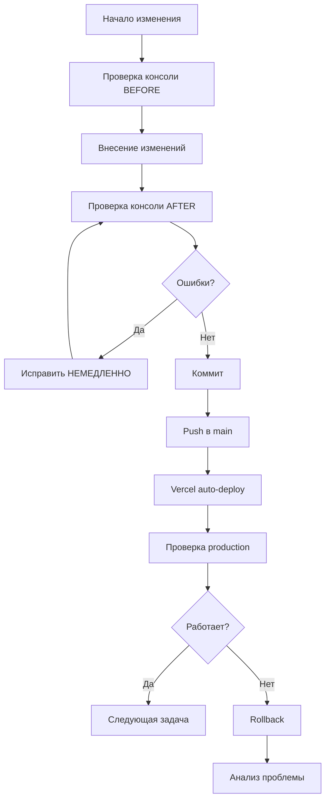

# 🔧 Стратегия рефакторинга UNITY-v2

**Дата создания**: 23 октября 2025  
**Основание**: [Комплексный аудит кодовой базы](../reports/COMPREHENSIVE_CODEBASE_AUDIT_2025-10-23.md)  
**Цель**: Навести порядок в кодовой базе без поломки production

---

## 🎯 Общая стратегия

### Принципы безопасного рефакторинга

1. **Safety First** - безопасность превыше скорости
2. **Test Before Commit** - тестировать КАЖДОЕ изменение через Chrome DevTools MCP
3. **Incremental Changes** - маленькие шаги, частые коммиты
4. **Rollback Ready** - всегда готовы откатиться назад
5. **Production Monitoring** - следить за Vercel деплоями

### Workflow для КАЖДОГО изменения



---

## 📋 Порядок выполнения задач

### Фаза 1: Критичные исправления (P0) - 1-2 дня

**Цель**: Устранить security и performance проблемы БД

#### 1.1 Supabase Security Fixes (2 часа)
**Приоритет**: 🔴 P0  
**Риск**: 🟢 Низкий (только БД)  
**Тестирование**: Supabase Advisors

**Задачи**:
- [ ] Добавить `SET search_path = public, pg_temp` в 5 функций:
  - `update_push_subscription_updated_at`
  - `get_users_with_entries_count`
  - `calculate_user_streak`
  - `get_users_with_stats`
  - `update_api_services_updated_at`
- [ ] Включить Leaked Password Protection в Supabase Dashboard
- [ ] Проверить через `get_advisors_supabase` (0 WARN security)

**Критерии завершения**:
- ✅ Supabase Security Advisors: 0 WARN
- ✅ Все функции имеют `SET search_path`
- ✅ Password Protection включен

---

#### 1.2 RLS Политики Оптимизация (4 часа)
**Приоритет**: 🔴 P0  
**Риск**: 🟡 Средний (может повлиять на доступ)  
**Тестирование**: Chrome DevTools + Supabase Advisors

**Задачи**:
- [ ] Заменить `auth.uid()` на `(select auth.uid())` в 12 политиках:
  - `push_notifications_history` (4 политики)
  - `usage` (4 политики)
  - `push_subscriptions` (4 политики)
- [ ] Объединить Multiple Permissive Policies (16 политик)
- [ ] Проверить через `get_advisors_supabase` (0 WARN performance)
- [ ] Тестировать доступ для user и super_admin

**Критерии завершения**:
- ✅ Supabase Performance Advisors: 0 WARN Auth RLS
- ✅ Все политики оптимизированы
- ✅ Доступ работает для обеих ролей

---

#### 1.3 Оптимизация БД Индексов (2 часа)
**Приоритет**: 🔴 P0  
**Риск**: 🟢 Низкий (только БД)  
**Тестирование**: Supabase Advisors

**Задачи**:
- [ ] Добавить индексы для foreign keys:
  - `CREATE INDEX idx_media_files_entry_id ON media_files(entry_id)`
  - `CREATE INDEX idx_media_files_user_id ON media_files(user_id)`
- [ ] Удалить 7 неиспользуемых индексов:
  - `DROP INDEX idx_usage_user_id`
  - `DROP INDEX idx_push_subscriptions_endpoint`
  - `DROP INDEX idx_push_history_created_at`
  - `DROP INDEX idx_push_history_status`
  - `DROP INDEX idx_push_history_sent_by`
  - `DROP INDEX idx_profiles_last_active`
  - `DROP INDEX idx_profiles_pwa_installed`
- [ ] Проверить через `get_advisors_supabase` (0 INFO unused indexes)

**Критерии завершения**:
- ✅ Supabase Performance Advisors: 0 INFO unused indexes
- ✅ Foreign keys имеют индексы
- ✅ Неиспользуемые индексы удалены

---

### Фаза 2: Удаление дубликатов (P0) - 2 часа

**Цель**: Устранить дублирование кода

#### 2.1 Удаление критичных дубликатов (2 часа)
**Приоритет**: 🔴 P0  
**Риск**: 🟡 Средний (может сломать импорты)  
**Тестирование**: Chrome DevTools (консоль)

**Задачи**:
- [ ] Удалить `src/features/mobile/media/hooks/useMediaUploader.ts`
  - Обновить импорты на `src/shared/hooks/useMediaUploader.ts`
  - Проверить консоль браузера
- [ ] Удалить `src/components/hooks/useSpeechRecognition.ts`
  - Обновить импорты на `src/shared/hooks/useSpeechRecognition.ts`
  - Проверить консоль браузера
- [ ] Удалить `src/components/ui/sidebar.tsx`
  - Обновить импорты на `src/shared/components/ui/sidebar.tsx`
  - Проверить консоль браузера
- [ ] Удалить `src/components/ui/shadcn-io/*` (все дубликаты)
  - Обновить импорты на `src/shared/components/ui/shadcn-io/*`
  - Проверить консоль браузера

**Критерии завершения**:
- ✅ Все дубликаты удалены
- ✅ Импорты обновлены
- ✅ Консоль браузера: 0 ошибок
- ✅ PWA работает
- ✅ Admin панель работает

---

### Фаза 3: Разбиение больших файлов (P1) - 3 дня

**Цель**: Сделать код AI-friendly

#### 3.1 Разбиение api.ts (1 день)
**Приоритет**: 🟡 P1  
**Риск**: 🔴 Высокий (критичный файл)  
**Тестирование**: Chrome DevTools + функциональное тестирование

**Стратегия**:
1. Создать микросервисы в `src/shared/lib/api/`:
   - `auth.ts` - аутентификация
   - `entries.ts` - записи
   - `media.ts` - медиа
   - `analytics.ts` - аналитика
   - `admin.ts` - админ функции
2. Постепенно мигрировать функции
3. Обновлять импорты по одному модулю
4. Тестировать после каждого модуля

**Критерии завершения**:
- ✅ api.ts разбит на 5+ файлов
- ✅ Каждый файл <300 строк
- ✅ Все импорты обновлены
- ✅ Консоль браузера: 0 ошибок

---

#### 3.2 Разбиение server/index.tsx (1 день)
**Приоритет**: 🟡 P1  
**Риск**: 🔴 Высокий (Edge Function)  
**Тестирование**: Chrome DevTools + Edge Function logs

**Стратегия**:
1. Создать отдельные Edge Functions:
   - `profiles-v5` - профили
   - `admin-api-v9` - админ API
   - `push-sender-v2` - push уведомления
2. Деплоить через Supabase MCP `deploy_edge_function_supabase`
3. Обновлять клиентский код постепенно
4. Тестировать каждую функцию отдельно

**Критерии завершения**:
- ✅ server/index.tsx разбит на 3+ Edge Functions
- ✅ Каждая функция <700 строк
- ✅ Все функции задеплоены
- ✅ Консоль браузера: 0 ошибок

---

#### 3.3 Разбиение больших компонентов (1 день)
**Приоритет**: 🟡 P1  
**Риск**: 🟡 Средний  
**Тестирование**: Chrome DevTools

**Файлы для разбиения**:
- `OnboardingScreen4.tsx` (933 строк) → 3-4 подкомпонента
- `SettingsScreen.tsx` (858 строк) → секции
- `ChatInputSection.tsx` (820 строк) → логика в hooks
- `AchievementHomeScreen.tsx` (749 строк) → подкомпоненты
- `AIAnalyticsTab.tsx` (712 строк) → виджеты

**Критерии завершения**:
- ✅ Все файлы <500 строк
- ✅ Логика вынесена в hooks
- ✅ Консоль браузера: 0 ошибок

---

### Фаза 4: Миграция legacy кода (P1) - 2 дня

**Цель**: Завершить переход на FSD архитектуру

#### 4.1 Миграция components/ (1 день)
**Приоритет**: 🟡 P1  
**Риск**: 🟡 Средний  
**Тестирование**: Chrome DevTools

**Стратегия**:
1. Найти все импорты из `src/components/`
2. Обновить импорты на `src/shared/components/`
3. Проверить консоль после каждого файла
4. Архивировать в `/old/components/`

**Критерии завершения**:
- ✅ Все импорты обновлены
- ✅ components/ перемещен в /old
- ✅ Консоль браузера: 0 ошибок

---

#### 4.2 Миграция utils/ (1 день)
**Приоритет**: 🟡 P1  
**Риск**: 🟡 Средний  
**Тестирование**: Chrome DevTools

**Стратегия**:
1. Найти все импорты из `src/utils/`
2. Обновить импорты на `src/shared/lib/`
3. Проверить консоль после каждого файла
4. Архивировать в `/old/utils/`

**Критерии завершения**:
- ✅ Все импорты обновлены
- ✅ utils/ перемещен в /old
- ✅ Консоль браузера: 0 ошибок

---

### Фаза 5: React Native подготовка (P2) - 2 недели

**Цель**: Довести React Native готовность до 100%

#### 5.1 Реализация Native адаптеров (1 неделя)
**Приоритет**: 🟢 P2  
**Риск**: 🟢 Низкий (не влияет на PWA)  
**Тестирование**: Unit tests

**Задачи**:
- [ ] Реализовать `NativeStorageAdapter` (AsyncStorage)
- [ ] Реализовать `NativeMediaAdapter` (ImagePicker)
- [ ] Реализовать `NativeNavigationAdapter` (React Navigation)
- [ ] Написать тесты для всех адаптеров

**Критерии завершения**:
- ✅ Все Native адаптеры реализованы
- ✅ Тесты покрывают 80%+ кода
- ✅ Документация обновлена

---

#### 5.2 Universal Components (1 неделя)
**Приоритет**: 🟢 P2  
**Риск**: 🟢 Низкий  
**Тестирование**: Unit tests

**Задачи**:
- [ ] Создать 10+ Universal Components:
  - Input, TextArea, Checkbox, Radio
  - Card, List, Grid
  - Toast, Alert, Dialog
- [ ] Написать тесты для всех компонентов

**Критерии завершения**:
- ✅ 15+ Universal Components
- ✅ Тесты покрывают 80%+ кода
- ✅ Storybook документация

---

## 🧪 Стратегия тестирования

### Перед КАЖДЫМ изменением

1. **Проверка консоли BEFORE**
   ```bash
   # Chrome DevTools MCP
   take_snapshot_chrome-devtools()
   list_console_messages_chrome-devtools()
   ```

2. **Проверка Supabase BEFORE**
   ```bash
   # Supabase MCP
   get_advisors_supabase(project_id='ecuwuzqlwdkkdncampnc', type='security')
   get_advisors_supabase(project_id='ecuwuzqlwdkkdncampnc', type='performance')
   ```

### После КАЖДОГО изменения

1. **Проверка консоли AFTER**
   ```bash
   # Chrome DevTools MCP
   take_snapshot_chrome-devtools()
   list_console_messages_chrome-devtools()
   ```

2. **Функциональное тестирование**
   - PWA: Вход → Создание записи → Просмотр истории → Выход
   - Admin: Вход → Просмотр пользователей → Настройки → Выход

3. **Проверка Vercel деплоя**
   - Дождаться успешного деплоя
   - Проверить production URL: https://unity-wine.vercel.app
   - Проверить консоль на production

### Критерии "зеленого света"

- ✅ Консоль браузера: 0 ошибок
- ✅ Supabase Advisors: 0 критичных WARN
- ✅ Vercel деплой: успешный
- ✅ PWA работает
- ✅ Admin панель работает

---

## 🚨 План отката (Rollback Strategy)

### Если что-то сломалось

1. **Немедленный откат**
   ```bash
   git revert HEAD
   git push origin main
   ```

2. **Анализ проблемы**
   - Проверить консоль браузера
   - Проверить Vercel logs
   - Проверить Supabase logs

3. **Исправление**
   - Создать hotfix
   - Тестировать локально
   - Деплоить снова

### Мониторинг production

- Проверять Vercel Dashboard каждые 30 минут
- Проверять Sentry для ошибок
- Проверять Supabase Dashboard для проблем БД

---

## 📊 Метрики успеха

### Code Quality
- Файлов >300 строк: 51 → 20 (-60%)
- Дубликатов кода: 10 → 0 (-100%)
- Legacy файлов: 62 → 0 (-100%)

### Architecture
- FSD соответствие: 95% → 100%
- AI-friendly: 75% → 95%
- React Native готовность: 90% → 100%

### Performance
- Supabase WARN: 34 → 0 (-100%)
- Неиспользуемые индексы: 7 → 0 (-100%)
- RLS оптимизация: 0% → 100%

---

## 🎯 Рекомендации по порядку выполнения

### Можно делать параллельно

- ✅ Supabase Security + RLS оптимизация (оба БД)
- ✅ Удаление дубликатов + Оптимизация индексов (независимы)
- ✅ React Native адаптеры + Universal Components (не влияют на PWA)

### Требуют последовательности

- ⚠️ Разбиение api.ts → Разбиение server/index.tsx (зависимость)
- ⚠️ Удаление дубликатов → Миграция legacy (сначала убрать дубликаты)
- ⚠️ Миграция components/ → Миграция utils/ (по очереди)

### Особая осторожность

- 🔴 Разбиение api.ts - критичный файл, маленькие шаги
- 🔴 Разбиение server/index.tsx - Edge Function, тестировать тщательно
- 🔴 RLS политики - может повлиять на доступ, тестировать обе роли

---

**Автор**: AI Assistant (Augment Agent)  
**Дата**: 23 октября 2025  
**Версия**: 1.0

