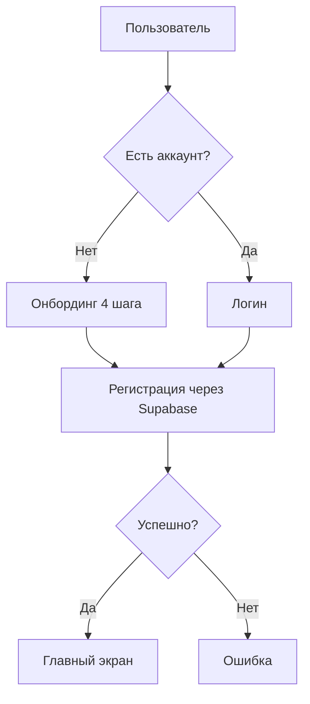
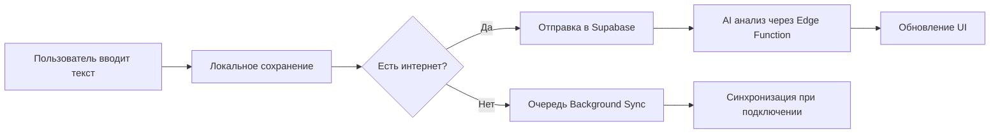
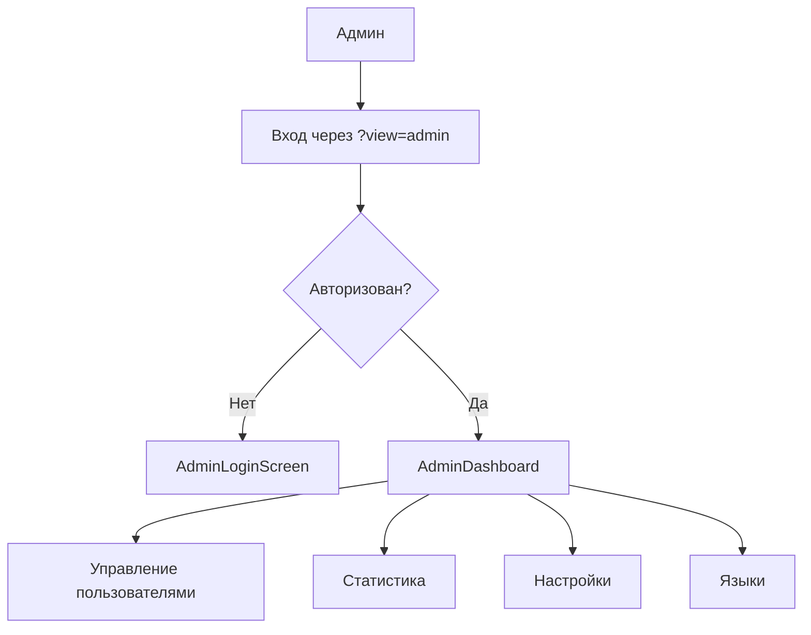

# UNITY - Архитектура проекта

## 📋 Общая информация

**Название**: UNITY - Дневник Достижений  
**Версия**: 2.3.5  
**Тип**: Progressive Web Application (PWA)  
**Статус**: Production Ready  
**Production URL**: https://unity-diary-app.netlify.app

## 🎯 Назначение проекта

UNITY - современное PWA приложение для ведения дневника достижений с AI-анализом, системой мотивации и отслеживанием прогресса пользователей.

### Основные возможности:
- Ведение дневника с текстовыми записями, голосовыми заметками и медиафайлами
- AI-анализ записей и генерация инсайтов
- Система достижений и наград
- Многоязычность (7 языков: ru, en, es, de, fr, zh, ja)
- PWA функционал (офлайн режим, установка на устройство, push-уведомления)
- Админ-панель для управления системой

## 🏗 Архитектура

### Технологический стек

#### Frontend
- **React 18.3.1** - UI фреймворк
- **TypeScript** - типизация
- **Vite 6.3.5** - сборщик и dev-сервер
- **Tailwind CSS** - стилизация
- **Radix UI** - UI компоненты (accordion, dialog, dropdown, etc.)
- **Motion (Framer Motion)** - анимации
- **Lucide React** - иконки
- **Recharts** - графики и визуализация данных

#### Backend & Infrastructure
- **Supabase** - Backend-as-a-Service
  - PostgreSQL база данных
  - Authentication (email, OAuth)
  - Row Level Security (RLS)
  - Edge Functions
  - Storage для медиафайлов
- **Netlify** - хостинг и CI/CD
- **GitHub** - version control

#### PWA
- Service Workers для офлайн работы
- Web App Manifest
- Push Notifications API
- Background Sync

### Структура проекта

```
unity/
├── src/
│   ├── components/           # React компоненты
│   │   ├── screens/         # Экраны приложения
│   │   │   ├── admin/       # Админ-панель
│   │   │   ├── AchievementHomeScreen.tsx
│   │   │   ├── HistoryScreen.tsx
│   │   │   ├── AchievementsScreen.tsx
│   │   │   ├── ReportsScreen.tsx
│   │   │   └── SettingsScreen.tsx
│   │   ├── ui/              # UI компоненты (Radix UI)
│   │   ├── i18n/            # Система интернационализации
│   │   ├── hooks/           # Custom React hooks
│   │   ├── WelcomeScreen.tsx
│   │   ├── OnboardingScreen*.tsx
│   │   ├── AuthScreen.tsx
│   │   ├── AdminLoginScreen.tsx
│   │   ├── InstallPrompt.tsx
│   │   ├── PWA*.tsx         # PWA компоненты
│   │   └── ...
│   ├── utils/               # Утилиты
│   │   ├── api.ts          # API функции
│   │   ├── auth.ts         # Авторизация
│   │   ├── i18n.ts         # Переводы (legacy)
│   │   ├── i18n/           # Новая система i18n
│   │   ├── pwaUtils.ts     # PWA утилиты
│   │   └── supabase/       # Supabase клиент
│   ├── App.tsx             # Главный компонент
│   ├── main.tsx            # Entry point
│   └── index.css           # Глобальные стили
├── supabase/
│   ├── functions/          # Edge Functions
│   └── migrations/         # Миграции БД
├── docs/                   # Документация
├── public/                 # Статические файлы
├── build/                  # Production сборка
├── .env                    # Переменные окружения
├── vite.config.ts          # Конфигурация Vite
├── package.json            # Зависимости
└── netlify.toml           # Конфигурация Netlify
```

## 🔄 Потоки данных

### Аутентификация


### Создание записи


### Админ-панель


## 📦 Модули и компоненты

### Основные модули

#### 1. Система авторизации (`utils/auth.ts`)
- Регистрация/вход через email
- OAuth провайдеры (Google, Apple, Facebook, Telegram)
- Проверка сессии
- Выход из системы

#### 2. API модуль (`utils/api.ts`)
- CRUD операции для записей
- Управление профилем пользователя
- AI анализ текста
- Работа с достижениями
- Статистика

#### 3. Интернационализация (`components/i18n/`)
- **TranslationProvider** - контекст переводов
- **TranslationManager** - управление загрузкой
- **TranslationLoader** - динамическая загрузка языков
- **useTranslation** - хук для компонентов
- Поддержка 7 языков: ru, en, es, de, fr, zh, ja

#### 4. PWA система
- **PWAHead** - meta теги и манифест
- **PWAStatus** - статус установки
- **PWAUpdatePrompt** - уведомления об обновлениях
- **InstallPrompt** - промпт установки
- **pwaUtils.ts** - утилиты PWA

#### 5. Админ-панель (`components/screens/admin/`)
- **AdminDashboard** - главная панель
- **UsersManagementTab** - управление пользователями
- **StatisticsTab** - статистика
- **SettingsTab** - настройки системы
- **LanguagesTab** - управление переводами

### Экраны приложения

#### Публичные экраны
1. **WelcomeScreen** - приветственный экран с выбором языка
2. **OnboardingScreen2-4** - онбординг (3 шага)
3. **AuthScreen** - вход/регистрация

#### Основные экраны (после авторизации)
1. **AchievementHomeScreen** - главная страница с записями
2. **HistoryScreen** - история записей
3. **AchievementsScreen** - достижения и награды
4. **ReportsScreen** - AI отчеты и аналитика
5. **SettingsScreen** - настройки профиля

#### Навигация
- **MobileBottomNav** - нижняя навигация (5 вкладок)
- **MobileHeader** - верхний хедер

## 🗄 База данных (Supabase)

### Таблицы

#### users (профили пользователей)
```sql
- id: uuid (PK)
- email: text
- name: text
- avatar_url: text
- diary_name: text
- diary_emoji: text
- language: text
- notification_settings: jsonb
- created_at: timestamp
- updated_at: timestamp
```

#### entries (записи дневника)
```sql
- id: uuid (PK)
- user_id: uuid (FK -> users.id)
- content: text
- ai_analysis: jsonb
- media_urls: text[]
- voice_url: text
- created_at: timestamp
- updated_at: timestamp
```

#### achievements (достижения)
```sql
- id: uuid (PK)
- user_id: uuid (FK -> users.id)
- type: text
- title: text
- description: text
- icon: text
- unlocked_at: timestamp
```

### Row Level Security (RLS)
- Пользователи видят только свои данные
- Админы имеют расширенные права через service_role

## 🔐 Безопасность

### Аутентификация
- JWT токены через Supabase Auth
- Refresh tokens для продления сессии
- Secure cookies (httpOnly)

### Авторизация
- Row Level Security (RLS) на уровне БД
- Проверка прав доступа в Edge Functions
- Разделение admin/user ролей

### Данные
- HTTPS для всех запросов
- Шифрование данных в Supabase
- Валидация на клиенте и сервере

## 🚀 Деплой и CI/CD

### Netlify
- **URL**: https://unity-diary-app.netlify.app
- **Автодеплой**: при push в `main`
- **Build command**: `npm run build`
- **Publish directory**: `build/`
- **Redirects**: SPA routing через `netlify.toml`

### GitHub Actions
- Автоматическая сборка
- Проверка линтинга (планируется)
- Тесты (планируется)

### Переменные окружения
```env
VITE_SUPABASE_URL=https://ecuwuzqlwdkkdncampnc.supabase.co
VITE_SUPABASE_ANON_KEY=<anon_key>
```

## 📊 Производительность

### Метрики сборки
- **Размер JS**: ~878KB (gzipped: 243KB)
- **Размер CSS**: ~91KB (gzipped: 14KB)
- **Время сборки**: ~6 секунд
- **Время деплоя**: ~13 секунд

### Оптимизации
- Code splitting по модулям:
  - `react-vendor` - React и core библиотеки
  - `ui-vendor` - Radix UI компоненты
  - `charts-vendor` - Recharts
  - `admin` - админ-панель (lazy load)
  - `icons-vendor` - Lucide icons
- Минификация и сжатие
- Lazy loading компонентов
- Оптимизация изображений

## 🧪 Тестирование

### Текущее состояние
- Ручное тестирование функционала
- Тестирование на разных устройствах
- PWA тестирование в Chrome DevTools

### Планируется
- Unit тесты (Jest/Vitest)
- E2E тесты (Playwright)
- Автоматизированное тестирование в CI/CD

## 📱 Поддерживаемые платформы

### Desktop
- Chrome 90+
- Firefox 88+
- Safari 14+
- Edge 90+

### Mobile
- iOS Safari 14+
- Android Chrome 90+
- PWA установка на iOS и Android

### Адаптивность
- Mobile: 320px - 767px
- Tablet: 768px - 1023px
- Desktop: 1024px+

## 🔄 Версионирование

### Текущая версия: 2.3.5

Используется семантическое версионирование (SemVer):
- **MAJOR** - несовместимые изменения API
- **MINOR** - новая функциональность (обратно совместимая)
- **PATCH** - исправления багов

### Changelog
Все изменения документируются в `/docs/CHANGELOG.md`

## 📚 Документация

### Основные документы
- `README.md` - быстрый старт
- `docs/PROJECT_OVERVIEW.md` - обзор проекта
- `docs/CHANGELOG.md` - история изменений
- `docs/ADMIN_PANEL.md` - документация админ-панели
- `docs/PWA_FEATURES.md` - PWA возможности
- `docs/DEPLOY_SUCCESS.md` - инструкции по деплою

### Техническая документация
- `ADMIN_API_SETTINGS.md` - API настройки админки
- `DESIGN_SYSTEM.md` - дизайн-система
- `I18N_IMPLEMENTATION_REPORT.md` - интернационализация

## 🎯 Roadmap

### Краткосрочные цели (1-3 месяца)
- [ ] Добавить unit и E2E тесты
- [ ] Оптимизировать размер бандла
- [ ] Улучшить офлайн режим
- [ ] Добавить больше языков

### Среднесрочные цели (3-6 месяцев)
- [ ] Мобильные приложения (React Native)
- [ ] Расширенная AI аналитика
- [ ] Социальные функции
- [ ] Интеграция с внешними сервисами

### Долгосрочные цели (6-12 месяцев)
- [ ] Монетизация (подписки)
- [ ] Корпоративная версия
- [ ] API для сторонних разработчиков
- [ ] Marketplace плагинов

## 👥 Роли и ответственность

### Разработка
- **Frontend**: React, TypeScript, UI/UX
- **Backend**: Supabase, Edge Functions
- **DevOps**: Netlify, CI/CD

### Дизайн
- Figma макеты
- Дизайн-система
- UI/UX исследования

### Управление
- Product Owner
- Техническое руководство
- Документация

## 🔗 Полезные ссылки

- **Production**: https://unity-diary-app.netlify.app
- **GitHub**: https://github.com/KLASTER-DIGITAL/unity
- **Netlify Dashboard**: https://app.netlify.com/projects/unity-diary-app
- **Supabase Dashboard**: https://supabase.com/dashboard/project/ecuwuzqlwdkkdncampnc

## 📄 Лицензия

MIT License - свободное использование и модификация

---

**Документ актуализирован**: 2025-10-13  
**Версия документа**: 1.0
