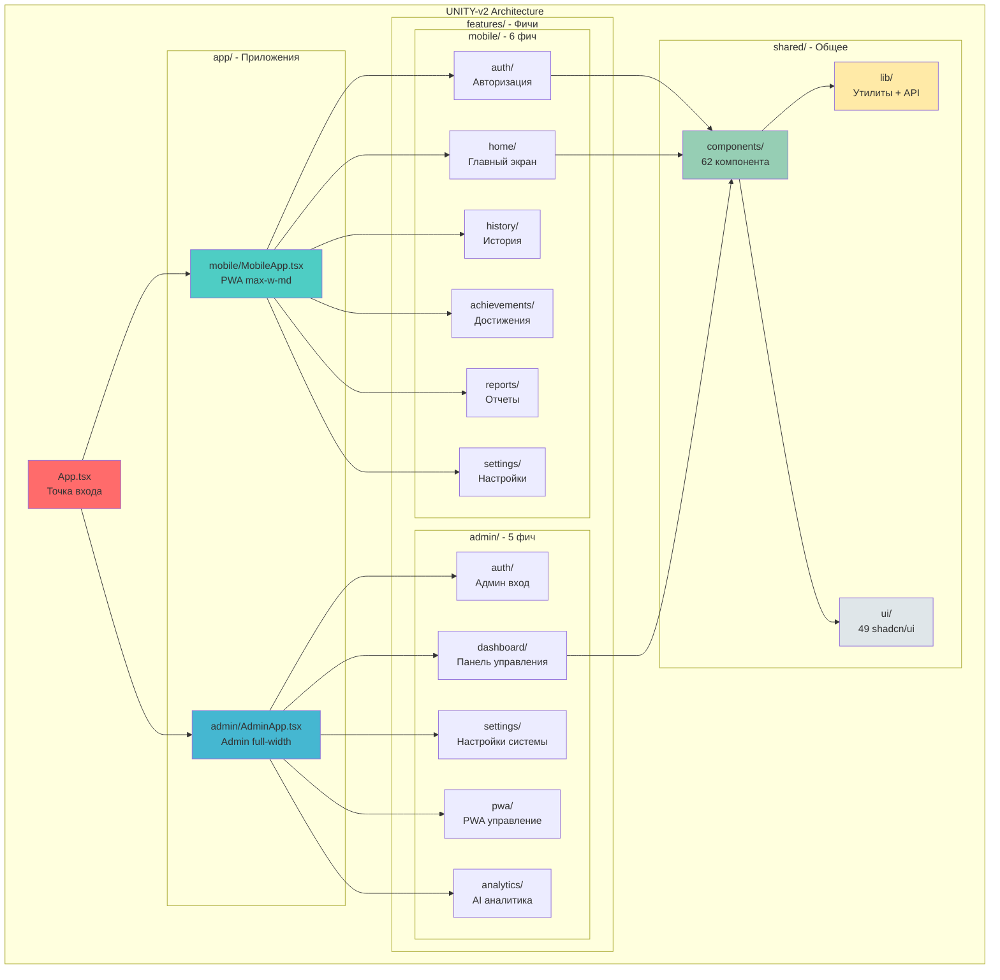
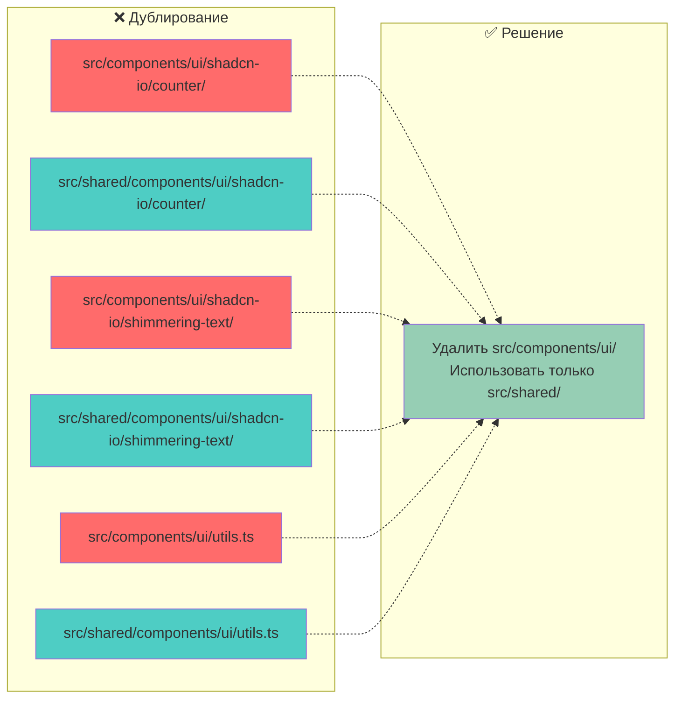
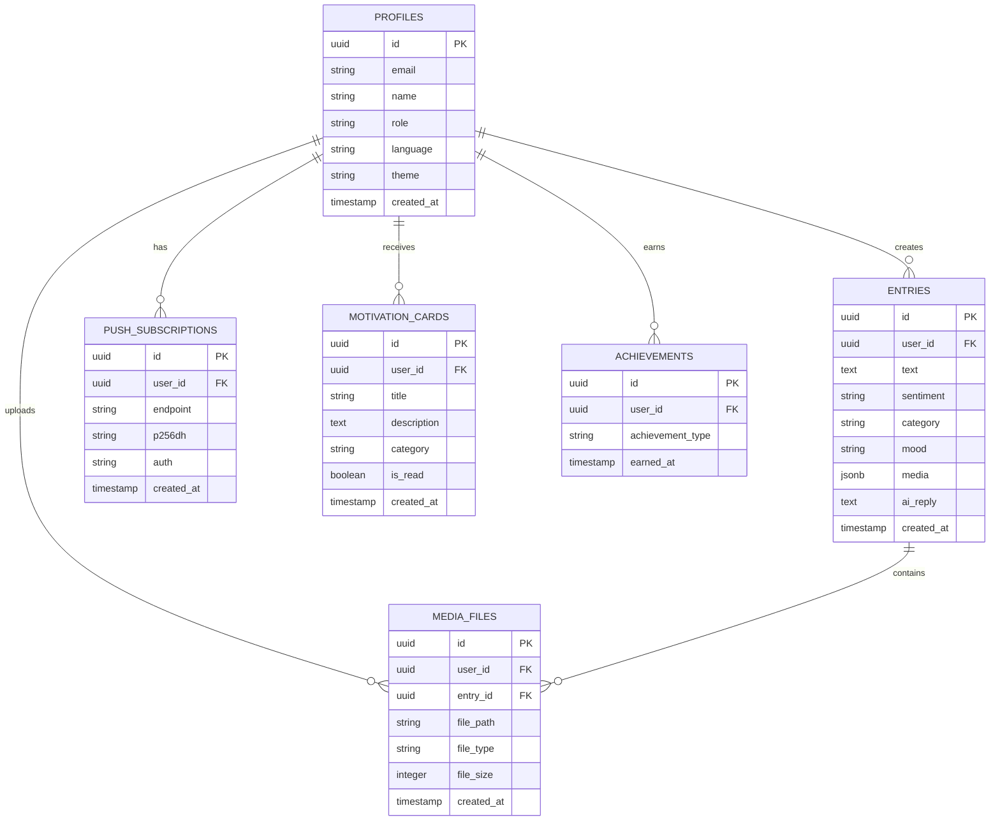
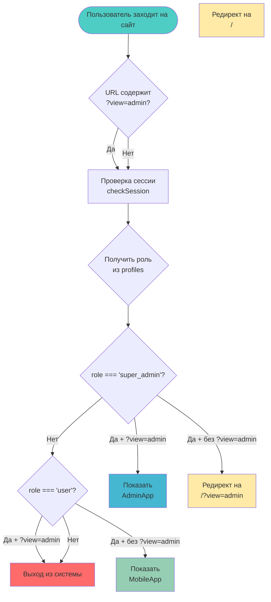
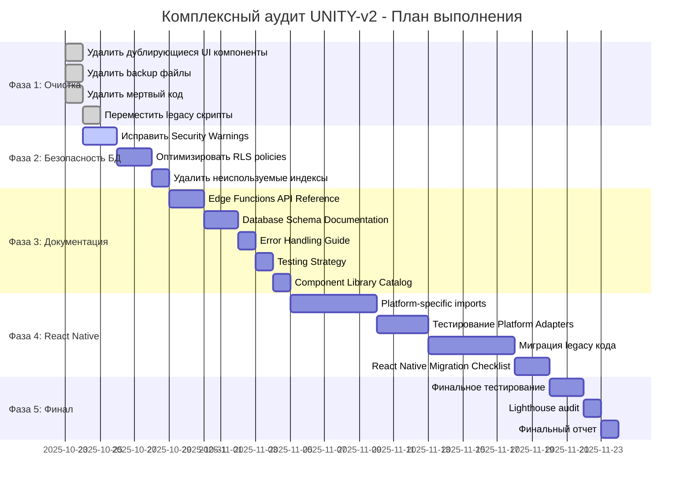
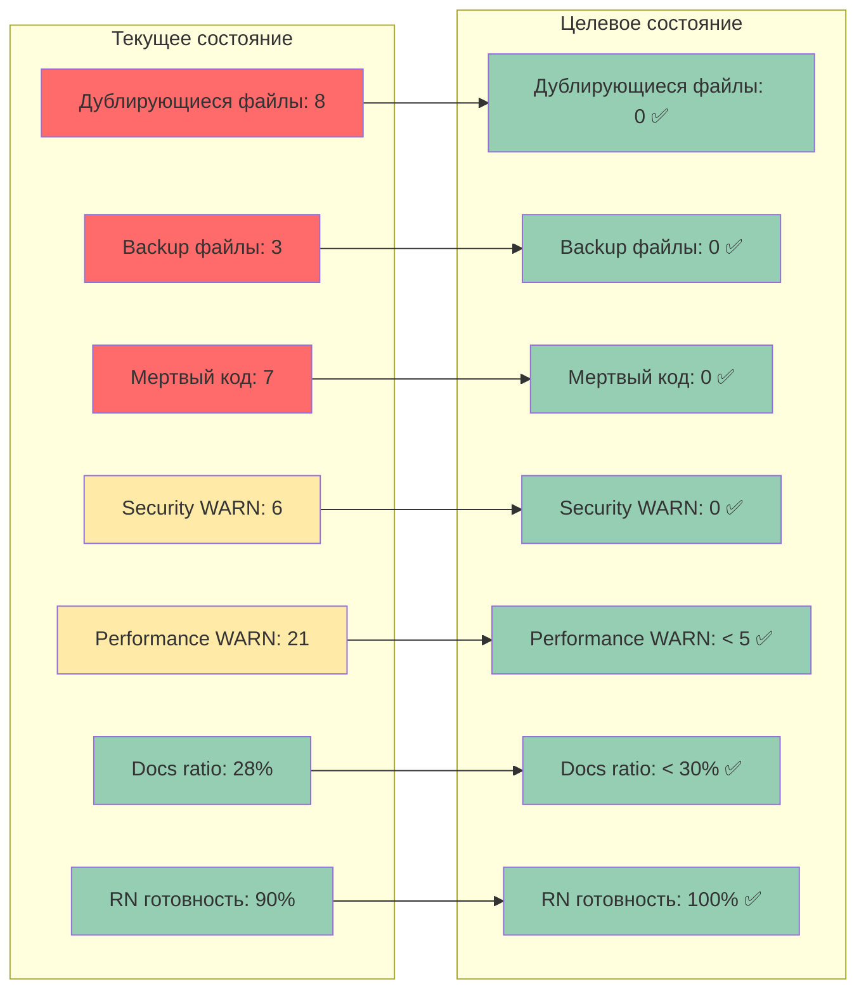

# 📊 Визуальное руководство по аудиту UNITY-v2

**Дата:** 2025-10-23  
**Связанные документы:**
- [COMPREHENSIVE_CODEBASE_AUDIT_2025-10-23.md](COMPREHENSIVE_CODEBASE_AUDIT_2025-10-23.md) - Полный отчет
- [AUDIT_EXECUTIVE_SUMMARY_2025-10-23.md](AUDIT_EXECUTIVE_SUMMARY_2025-10-23.md) - Краткая сводка

---

## 🏗️ Архитектура проекта

### Текущая структура Feature-Sliced Design



---

## 🔍 Проблемы кодовой базы

### Дублирование компонентов



---

## 🗄️ База данных

### Схема основных таблиц



---

## 🔐 RBAC (Role-Based Access Control)

### Контроль доступа



---

## 🚀 Action Plan Timeline

### Фазы выполнения



---

## 📊 Метрики прогресса

### Текущее vs Целевое состояние



---

## 🔄 Edge Functions Architecture

### Микросервисная архитектура

```mermaid
graph TB
    subgraph "Client"
        PWA[PWA App]
        Admin[Admin Panel]
    end
    
    subgraph "Edge Functions (13 микросервисов)"
        AdminAPI[admin-api<br/>Админ API]
        AIAnalysis[ai-analysis<br/>AI анализ]
        AutoTranslate[auto-translate<br/>Автоперевод]
        Entries[entries<br/>CRUD записей]
        Media[media<br/>Медиафайлы]
        Motivations[motivations<br/>Мотивация]
        Profiles[profiles<br/>Профили]
        PushSender[push-sender<br/>Push уведомления]
        Stats[stats<br/>Статистика]
        TelegramAuth[telegram-auth<br/>Telegram вход]
        Transcription[transcription-api<br/>Транскрипция]
        TranslationsAPI[translations-api<br/>API переводов]
        TranslationsMgmt[translations-management<br/>Управление переводами]
    end
    
    subgraph "Supabase"
        DB[(PostgreSQL<br/>15 таблиц)]
        Storage[(Storage<br/>Медиа)]
        Auth[(Auth<br/>Пользователи)]
    end
    
    subgraph "External APIs"
        OpenAI[OpenAI<br/>GPT-4 / GPT-4o-mini]
        WebPush[Web Push<br/>VAPID]
    end
    
    PWA --> Entries
    PWA --> Media
    PWA --> Profiles
    PWA --> Stats
    PWA --> Motivations
    PWA --> TelegramAuth
    
    Admin --> AdminAPI
    Admin --> AutoTranslate
    Admin --> TranslationsMgmt
    Admin --> PushSender
    
    Entries --> DB
    Media --> Storage
    Profiles --> Auth
    AdminAPI --> DB
    
    AIAnalysis --> OpenAI
    AutoTranslate --> OpenAI
    Transcription --> OpenAI
    PushSender --> WebPush
    
    style PWA fill:#4ecdc4
    style Admin fill:#45b7d1
    style DB fill:#96ceb4
    style Storage fill:#ffeaa7
    style Auth fill:#dfe6e9
    style OpenAI fill:#ff6b6b
    style WebPush fill:#ff6b6b
```



---

## 🎯 Приоритизация задач

### Impact vs Effort Matrix

```mermaid
quadrantChart
    title Impact vs Effort Matrix
    x-axis Low Effort --> High Effort
    y-axis Low Impact --> High Impact
    quadrant-1 Schedule (High Impact, High Effort)
    quadrant-2 Do First (High Impact, Low Effort)
    quadrant-3 Fill In (Low Impact, Low Effort)
    quadrant-4 Don't Do (Low Impact, High Effort)
    
    Удалить дублирующиеся UI: [0.2, 0.9]
    Удалить backup файлы: [0.1, 0.8]
    Исправить Security WARN: [0.3, 0.9]
    Добавить константы: [0.2, 0.7]
    
    Исправить Performance WARN: [0.6, 0.8]
    Миграция legacy кода: [0.7, 0.7]
    Platform-specific imports: [0.6, 0.8]
    
    Переместить legacy скрипты: [0.1, 0.3]
    Добавить JSDoc: [0.4, 0.4]
    Комментарии в Edge Functions: [0.3, 0.3]
    
    Полная миграция на React Native: [0.9, 0.2]
```

---

**Дата создания:** 2025-10-23  
**Автор:** AI Assistant (Augment Agent)  
**Версия:** 1.0

